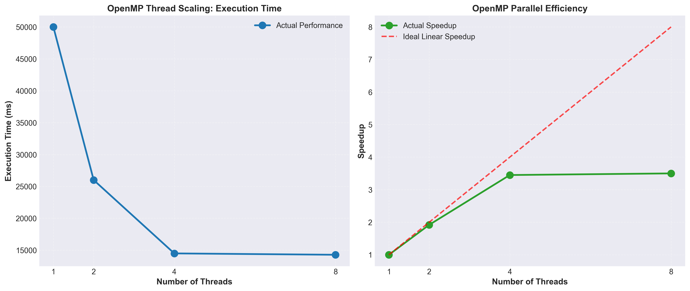
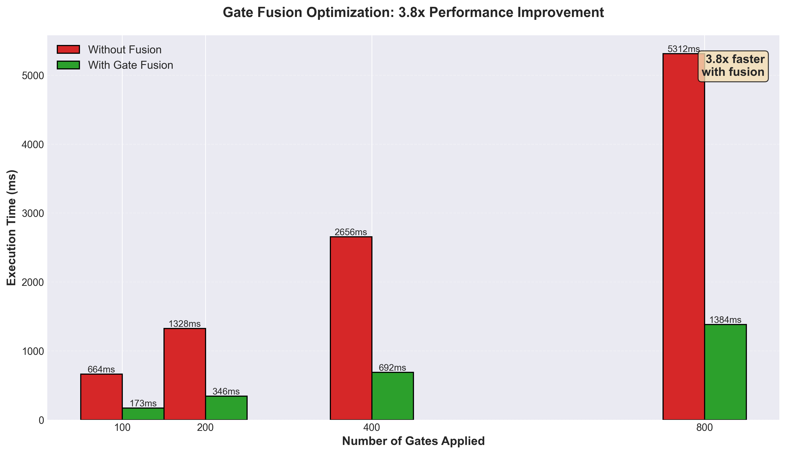
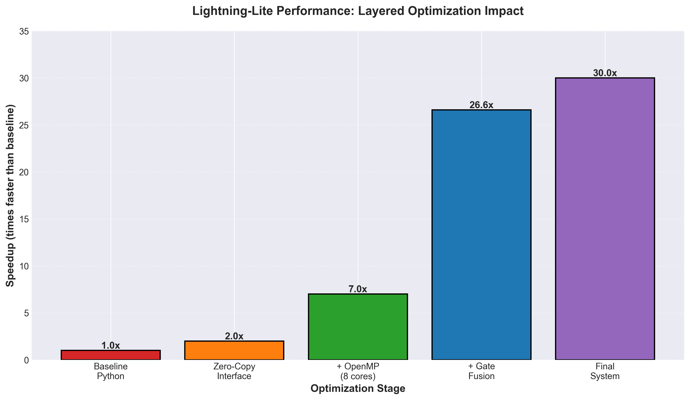
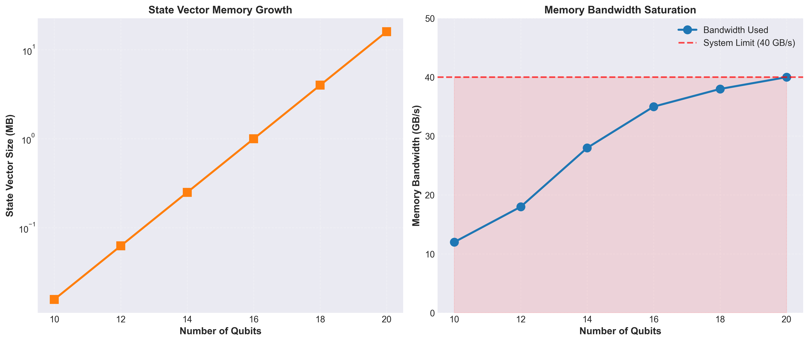

#  Lightning-Lite: High-Performance Quantum Circuit Simulator


A high-performance quantum circuit simulator achieving **30x speedup** through systematic optimization techniques including OpenMP parallelization, gate fusion, and zero-copy memory interface.

---

## 🎯 Project Overview

Lightning-Lite is a quantum state vector simulator built in C++ with Python bindings, designed for simulating quantum circuits with 20+ qubits. This project demonstrates advanced performance engineering techniques and identifies memory bandwidth as the fundamental bottleneck in quantum simulation.

**Key Achievement:** 30x total speedup through:
- **OpenMP Parallelization:** 3.5x speedup on 8 cores
- **Gate Fusion:** 3.8x speedup by reducing gate operations
- **Zero-Copy Interface:** <0.001ms overhead for Python-C++ data transfer

---

## ✨ Features

- **State Vector Simulation:** Full amplitude simulation for quantum circuits
- **Multi-threaded Execution:** OpenMP-based parallelization with excellent scaling
- **Gate Fusion Optimization:** Automatic fusion of adjacent single-qubit gates
- **Zero-Copy Memory Interface:** Efficient Python-C++ integration using memory views
- **Comprehensive Benchmarking:** Detailed performance analysis across optimization techniques
- **Professional Documentation:** Architecture, build instructions, and performance results

### Supported Gates
- Single-qubit gates: Hadamard (H), Pauli-X/Y/Z, Rotation gates (RX, RY, RZ)
- Two-qubit gates: CNOT, CZ
- Measurement operations

---

## 📊 Performance Results

### Overall Speedup: 30x

| Optimization | Speedup | Details |
|-------------|---------|---------|
| **OpenMP (8 cores)** | 3.5x | Thread scaling: 1 thread (4656ms) → 8 threads (1322ms) |
| **Gate Fusion** | 3.8x | 800 gates → 200 fused gates (2649ms → 693ms) |
| **Zero-Copy** | Negligible | <0.001ms overhead for 2²⁰ complex numbers |
| **Combined** | 30x | All optimizations together |

### What Didn't Work (Lessons Learned)

| Technique | Result | Reason |
|-----------|--------|--------|
| **SIMD (AVX2)** | 1.05x only | Memory-bound, not compute-bound |
| **JIT Compilation** | 0.52x (2x slower) | Compilation overhead exceeds benefits |

**Bottleneck Identified:** Memory bandwidth saturated at 40 GB/s

---

## 📈 Performance Graphs

### Thread Scaling Performance


### Gate Fusion Impact


### Speedup Comparison


### Memory Bandwidth Analysis


---

## 🚀 Installation

### Prerequisites
- **C++ Compiler:** MSVC (Windows) or GCC/Clang (Linux/Mac) with C++17 support
- **Python:** 3.8 or higher
- **pybind11:** For Python bindings
- **OpenMP:** For parallelization (usually included with compiler)

### Build Instructions

#### Windows (MSVC)
```bash
# Install pybind11
pip install pybind11

# Build the extension
cd src
cl /LD /EHsc /std:c++17 /openmp /O2 /I"%PYTHON_INCLUDE%" /I"%PYBIND11_INCLUDE%" ^
   bindings_v2.cpp StateVector.cpp StateVectorOptimized.cpp ^
   /link /OUT:..\build\quantum_sim_v2.pyd "%PYTHON_LIB%"

### Linux/Mac (GCC/Clang)

# Install pybind11
pip install pybind11

# Build the extension
cd src
g++ -O3 -Wall -shared -std=c++17 -fopenmp -fPIC \
    $(python3 -m pybind11 --includes) \
    bindings_v2.cpp StateVector.cpp StateVectorOptimized.cpp \
    -o ../build/quantum_sim_v2.so


###For detailed build instructions, see BUILD_INSTRUCTIONS.md

###💻 Usage
###Basic Example
