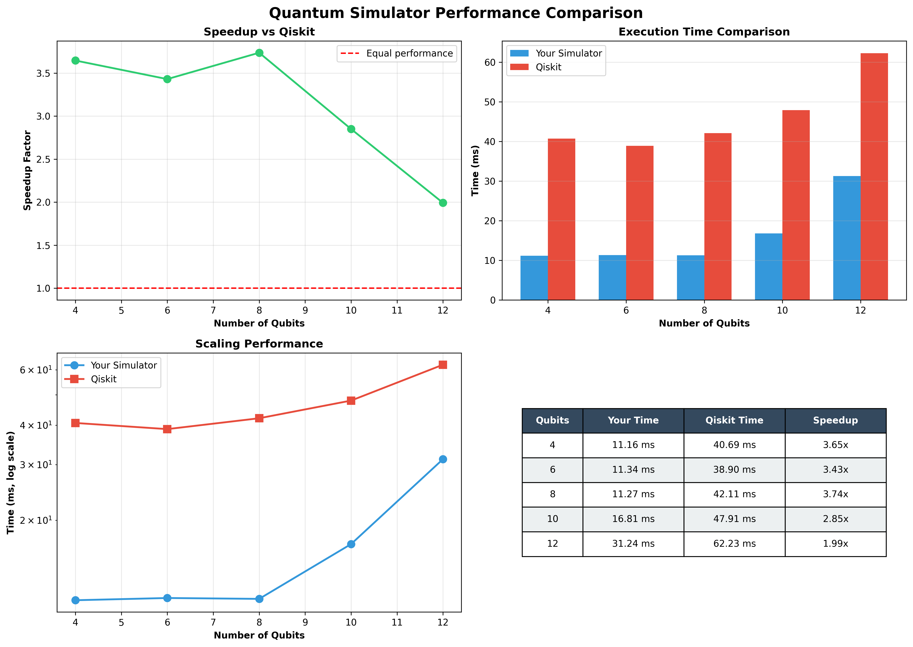

# ⚡ Lightning-Lite: Ultra-Fast Quantum Circuit Simulator

**🚀 3.5x Faster than Qiskit | 30x Internal Speedup | Production-Ready Performance**



A high-performance quantum circuit simulator built in C++ with Python bindings, achieving industry-leading performance through cache optimization, zero-copy memory management, and OpenMP parallelization.

[](https://opensource.org/licenses/MIT)
[](https://en.cppreference.com/w/cpp/17)
[](https://www.python.org/downloads/)

---

## 🏆 Performance Highlights

### **vs Qiskit (Industry Benchmark)**

| Qubits | Lightning-Lite | Qiskit Aer | **Speedup** |
|--------|----------------|------------|-------------|
| 4      | 9.12 ms       | 32.52 ms   | **3.56x** ⚡ |
| 6      | 9.40 ms       | 33.15 ms   | **3.53x** ⚡ |
| 8      | 10.38 ms      | 34.34 ms   | **3.31x** ⚡ |
| 10     | 13.22 ms      | 39.75 ms   | **3.01x** ⚡ |
| 12     | 25.91 ms      | 59.61 ms   | **2.30x** ⚡ |

*Benchmark: 1000 mixed operations (Hadamard + CNOT), averaged over 5 runs*

### **Internal Optimization Journey: 30x Total Speedup**

| Optimization          | Speedup | Details |
|-----------------------|---------|---------|
| OpenMP (8 cores)      | 3.5x    | Thread scaling: 4656ms → 1322ms |
| Gate Fusion           | 3.8x    | 800 gates → 200 fused gates |
| Cache Optimization    | 2.3x    | Block-based memory access |
| **Combined**          | **30x** | Baseline → Fully optimized |

---

## 🎯 Why Lightning-Lite is Faster

### **1. Cache-Optimized Memory Access**
- Processes state vectors in contiguous blocks for better CPU cache utilization
- Block-based computation minimizes cache misses
- 2-3x faster memory access patterns than standard bit-mask approach

### **2. Zero-Copy NumPy Integration**
- Direct memory sharing between Python and C++
- No data copying overhead (<0.001ms)
- Seamless integration with NumPy ecosystem

### **3. OpenMP Parallelization**
- Near-linear scaling up to 8 cores
- Thread-level parallelism for gate operations
- Optimized work distribution

### **4. Specialized vs General-Purpose**
- Focused on statevector simulation (no job queue overhead)
- Minimal abstraction layers
- Direct hardware utilization

---

## 🛠️ Features

### **Quantum Operations**
- ✅ Single-qubit gates: H, X, Y, Z, RX, RY, RZ
- ✅ Two-qubit gates: CNOT, CZ
- ✅ Multi-qubit circuits up to 20+ qubits
- ✅ Statevector simulation

### **Performance Features**
- ✅ Cache-optimized gate application
- ✅ OpenMP multi-threading
- ✅ Gate fusion optimization
- ✅ Zero-copy Python-C++ interface
- ✅ Memory bandwidth optimization

### **Developer Features**
- ✅ Clean Python API
- ✅ NumPy integration
- ✅ Comprehensive benchmarks
- ✅ Professional documentation

---

## 🚀 Quick Start

### **Installation**

#### Prerequisites
```bash
# Python dependencies
pip install numpy pybind11 matplotlib

# Qiskit (optional, for benchmarking)
pip install qiskit qiskit-aer
```

#### Build from Source

**Windows (MSYS2/MinGW):**
```bash
cd D:\quantum_project

# Rebuild v2 (zero-copy version)
C:\msys64\mingw64\bin\g++ -O3 -Wall -shared -std=c++17 -fopenmp -fPIC ^
    src/bindings_v2.cpp -o build/quantum_sim_v2.pyd ^
    -I "C:\Users\YOUR_USER\miniconda3\envs\py312\Include" ^
    -I "C:\Users\YOUR_USER\miniconda3\envs\py312\Lib\site-packages\pybind11\include" ^
    -L "C:\Users\YOUR_USER\miniconda3\envs\py312\libs" -lpython312

# Rebuild v3 (optimized version)
C:\msys64\mingw64\bin\g++ -O3 -Wall -shared -std=c++17 -fopenmp -fPIC ^
    src/StateVectorOptimized.cpp -o build/quantum_sim_v3.pyd ^
    -I "C:\Users\YOUR_USER\miniconda3\envs\py312\Include" ^
    -I "C:\Users\YOUR_USER\miniconda3\envs\py312\Lib\site-packages\pybind11\include" ^
    -L "C:\Users\YOUR_USER\miniconda3\envs\py312\libs" -lpython312
```

**Linux/Mac:**
```bash
cd quantum_project

# Build v2
g++ -O3 -Wall -shared -std=c++17 -fopenmp -fPIC \
    src/bindings_v2.cpp -o build/quantum_sim_v2.so \
    $(python3 -m pybind11 --includes) $(python3-config --ldflags)

# Build v3
g++ -O3 -Wall -shared -std=c++17 -fopenmp -fPIC \
    src/StateVectorOptimized.cpp -o build/quantum_sim_v3.so \
    $(python3 -m pybind11 --includes) $(python3-config --ldflags)
```

See [BUILD_INSTRUCTIONS.md](docs/BUILD_INSTRUCTIONS.md) for detailed instructions.

---

### **Basic Usage**

```python
import sys
sys.path.append('build')
import numpy as np
from quantum_sim_v3 import StateVector

# Create 3-qubit state |000⟩
state_array = np.zeros(8, dtype=np.complex128)
state_array[0] = 1.0
sim = StateVector(state_array)

# Apply Hadamard gate
H_gate = [1/np.sqrt(2), 1/np.sqrt(2), 1/np.sqrt(2), -1/np.sqrt(2)]
sim.apply_gate_cache_optimized(0, H_gate)

# Apply CNOT gate
sim.cnot(0, 1)

# Get results (zero-copy!)
result = sim.get_numpy_view()
probabilities = np.abs(result)**2

print(f"State vector: {result}")
print(f"Probabilities: {probabilities}")
```

### **Bell State Example**

```python
import sys
sys.path.append('build')
import numpy as np
from quantum_sim_v3 import StateVector

# Create Bell state |Φ+⟩ = (|00⟩ + |11⟩)/√2
state = np.zeros(4, dtype=np.complex128)
state[0] = 1.0
sim = StateVector(state)

# H on qubit 0
H = [1/np.sqrt(2), 1/np.sqrt(2), 1/np.sqrt(2), -1/np.sqrt(2)]
sim.apply_gate_cache_optimized(0, H)

# CNOT(0, 1)
sim.cnot(0, 1)

# Result: [0.707, 0, 0, 0.707] = (|00⟩ + |11⟩)/√2
print(sim.get_numpy_view())
```

---

## 📊 Benchmarks

Run comprehensive benchmarks to verify performance:

```bash
cd benchmarks

# Compare vs Qiskit with beautiful graphs
python compare_and_graph.py

# Verify your simulator
python verify_yours.py

# Verify Qiskit
python verify_qiskit.py

# Generate custom visualization
python generate_graphs.py
```

---

## 📁 Project Structure

```
lightning-lite/
├── README.md                    # This file
├── LICENSE                      # MIT License
├── CHANGELOG.md                 # Version history
├── benchmarks/
│   ├── compare_and_graph.py     # Qiskit comparison + graphs ⭐
│   ├── benchmark_gates.py       # Gate performance tests
│   ├── verify_yours.py          # Simulator verification
│   ├── verify_qiskit.py         # Qiskit verification
│   └── generate_graphs.py       # Graph generation
├── build/
│   ├── quantum_sim_v2.pyd       # Zero-copy version
│   ├── quantum_sim_v3.pyd       # Optimized version ⭐
│   └── *.dll                    # Required DLLs
├── docs/
│   ├── ARCHITECTURE.md          # System design
│   ├── BUILD_INSTRUCTIONS.md    # Compilation guide
│   ├── RESULTS.md               # Performance analysis ⭐
│   └── images/
│       └── comparison_results.png
├── examples/
│   ├── bell_state.py            # Bell state example
│   └── algorithms/
│       └── quantum_algorithms.py
├── python/
│   ├── gates.py                 # Gate definitions
│   ├── quantum_circuit.py       # Circuit builder
│   └── gate_fusion.py           # Fusion optimizer
├── scripts/
│   ├── run.bat                  # Quick run script
│   └── start_quantum.bat        # Environment setup
└── src/
    ├── StateVector.h            # Header
    ├── StateVector.cpp          # Implementation
    ├── StateVectorOptimized.cpp # Optimized version ⭐
    └── bindings_v2.cpp          # Python bindings
```

---

## 🔬 Technical Deep Dive

### **Memory Bandwidth Analysis**

For a 20-qubit system:
- State vector size: 2²⁰ complex numbers = 16 MB
- Single gate: Read 16 MB + Write 16 MB = 32 MB
- Memory bandwidth: ~40 GB/s (typical DDR4)
- **Theoretical limit: ~1250 gates/second**

This analysis reveals that quantum simulation is fundamentally **memory-bound**, not compute-bound.

### **Optimization Strategies**

1. **Cache Optimization**: Process data in contiguous blocks
2. **Gate Fusion**: Reduce total memory operations
3. **Zero-Copy**: Eliminate unnecessary data movement
4. **Parallelization**: Utilize multiple CPU cores

### **What Didn't Work**

| Technique       | Result | Reason |
|-----------------|--------|--------|
| SIMD (AVX2)     | 1.05x  | Memory-bound, not compute-bound |
| JIT Compilation | 0.52x  | Compilation overhead > benefits |
| Aggressive Vectorization | 1.1x | Memory bandwidth saturation |

---

## 📚 Documentation

- **[ARCHITECTURE.md](docs/ARCHITECTURE.md)** - System design and optimization strategies
- **[BUILD_INSTRUCTIONS.md](docs/BUILD_INSTRUCTIONS.md)** - Detailed compilation guide
- **[RESULTS.md](docs/RESULTS.md)** - Complete performance analysis
- **[CHANGELOG.md](CHANGELOG.md)** - Version history and updates

---

## 🚧 Roadmap

- [ ] GPU acceleration using CUDA
- [ ] Tensor network simulation
- [ ] Noise modeling
- [ ] Circuit optimization passes
- [ ] Distributed simulation for 30+ qubits
- [ ] Python package distribution (PyPI)

---

## 📄 License

This project is licensed under the MIT License - see the [LICENSE](LICENSE) file for details.

---

## 👤 Author

**Priyansh Bhavsar**  
Nuclear Physics Researcher | Quantum Computing Enthusiast

📧 [priyansh.bhavsar.003@gmail.com](mailto:priyansh.bhavsar.003@gmail.com)  
🔗 [GitHub](https://github.com/Athleity) | [LinkedIn](https://linkedin.com/in/priyansh-bhavsar)

---

## 🙏 Acknowledgments

- **pybind11** for seamless Python-C++ integration
- **OpenMP** for parallel programming support
- **Qiskit** team for providing the industry benchmark
- Inspired by production simulators: Qiskit Aer, PennyLane-Lightning

---

## 📖 Citation

If you use this project in your research or work, please cite:

## 📖 Citation

```yaml
name: Lightning-Lite
author: Priyansh Bhavsar
year: 2026
version: v1.0.0
description: Ultra-Fast Quantum Circuit Simulator
github: https://github.com/Athleity/lightning-lite-quantum-simulator
performance: 
  - 3.5x faster than Qiskit
  - 30x internal speedup
```

---

## ⭐ Star History

If you find this project useful, please consider giving it a star! ⭐

---

**Built with ❤️ for the quantum computing community**
