# ⚡ Lightning-Lite: Ultra-Fast Quantum Circuit Simulator

**🚀 3.5x Faster than Qiskit | 30x Internal Speedup | Production-Ready Performance**


A high-performance quantum circuit simulator built in C++ with Python bindings, achieving industry-leading performance through cache optimization, zero-copy memory management, and OpenMP parallelization.

[](https://opensource.org/licenses/MIT)
[](https://en.cppreference.com/w/cpp/17)
[](https://www.python.org/downloads/)

---

## 🏆 Performance Highlights

### **vs Qiskit (Industry Benchmark)**

| Qubits | Lightning-Lite | Qiskit Aer | **Speedup** |
|--------|----------------|------------|-------------|
| 4      | 9.12 ms       | 32.52 ms   | **3.56x** ⚡ |
| 6      | 9.40 ms       | 33.15 ms   | **3.53x** ⚡ |
| 8      | 10.38 ms      | 34.34 ms   | **3.31x** ⚡ |
| 10     | 13.22 ms      | 39.75 ms   | **3.01x** ⚡ |
| 12     | 25.91 ms      | 59.61 ms   | **2.30x** ⚡ |

*Benchmark: 1000 mixed operations (Hadamard + CNOT), averaged over 5 runs*

### **Internal Optimization Journey: 30x Total Speedup**

| Optimization          | Speedup | Details |
|-----------------------|---------|---------|
| OpenMP (8 cores)      | 3.5x    | Thread scaling: 4656ms → 1322ms |
| Gate Fusion           | 3.8x    | 800 gates → 200 fused gates |
| Cache Optimization    | 2.3x    | Block-based memory access |
| **Combined**          | **30x** | Baseline → Fully optimized |

---

## 🎯 Why Lightning-Lite is Faster

### **1. Cache-Optimized Memory Access**
- Processes state vectors in contiguous blocks for better CPU cache utilization
- Block-based computation minimizes cache misses
- 2-3x faster memory access patterns than standard bit-mask approach

### **2. Zero-Copy NumPy Integration**
- Direct memory sharing between Python and C++
- No data copying overhead (<0.001ms)
- Seamless integration with NumPy ecosystem

### **3. OpenMP Parallelization**
- Near-linear scaling up to 8 cores
- Thread-level parallelism for gate operations
- Optimized work distribution

### **4. Specialized vs General-Purpose**
- Focused on statevector simulation (no job queue overhead)
- Minimal abstraction layers
- Direct hardware utilization

---

## 🛠️ Features

### **Quantum Operations**
- ✅ Single-qubit gates: H, X, Y, Z, RX, RY, RZ
- ✅ Two-qubit gates: CNOT, CZ
- ✅ Multi-qubit circuits up to 20+ qubits
- ✅ Statevector simulation

### **Performance Features**
- ✅ Cache-optimized gate application
- ✅ OpenMP multi-threading
- ✅ Gate fusion optimization
- ✅ Zero-copy Python-C++ interface
- ✅ Memory bandwidth optimization

### **Developer Features**
- ✅ Clean Python API
- ✅ NumPy integration
- ✅ Comprehensive benchmarks
- ✅ Professional documentation

---

## 🚀 Quick Start

### **Installation**

#### Prerequisites
```bash
# Python dependencies
pip install numpy pybind11 matplotlib

# Qiskit (optional, for benchmarking)
pip install qiskit qiskit-aer
```

#### Build from Source

**Windows (MSYS2/MinGW):**
```bash
cd D:\quantum_project

# Rebuild v2 (zero-copy version)
C:\msys64\mingw64\bin\g++ -O3 -Wall -shared -std=c++17 -fopenmp -fPIC ^
    src/bindings_v2.cpp -o build/quantum_sim_v2.pyd ^
    -I "C:\Users\YOUR_USER\miniconda3\envs\py312\Include" ^
    -I "C:\Users\YOUR_USER\miniconda3\envs\py312\Lib\site-packages\pybind11\include" ^
    -L "C:\Users\YOUR_USER\miniconda3\envs\py312\libs" -lpython312

# Rebuild v3 (optimized version)
C:\msys64\mingw64\bin\g++ -O3 -Wall -shared -std=c++17 -fopenmp -fPIC ^
    src/StateVectorOptimized.cpp -o build/quantum_sim_v3.pyd ^
    -I "C:\Users\YOUR_USER\miniconda3\envs\py312\Include" ^
    -I "C:\Users\YOUR_USER\miniconda3\envs\py312\Lib\site-packages\pybind11\include" ^
    -L "C:\Users\YOUR_USER\miniconda3\envs\py312\libs" -lpython312
```

**Linux/Mac:**
```bash
cd quantum_project

# Build v2
g++ -O3 -Wall -shared -std=c++17 -fopenmp -fPIC \
    src/bindings_v2.cpp -o build/quantum_sim_v2.so \
    $(python3 -m pybind11 --includes) $(python3-config --ldflags)

# Build v3
g++ -O3 -Wall -shared -std=c++17 -fopenmp -fPIC \
    src/StateVectorOptimized.cpp -o build/quantum_sim_v3.so \
    $(python3 -m pybind11 --includes) $(python3-config --ldflags)
```

See [BUILD_INSTRUCTIONS.md](docs/BUILD_INSTRUCTIONS.md) for detailed instructions.

---

### **Basic Usage**

```python
import sys
sys.path.append('build')
import numpy as np
from quantum_sim_v3 import StateVector

# Create 3-qubit state |000⟩
state_array = np.zeros(8, dtype=np.complex128)
state_array[0] = 1.0
sim = StateVector(state_array)

# Apply Hadamard gate
H_gate = [1/np.sqrt(2), 1/np.sqrt(2), 1/np.sqrt(2), -1/np.sqrt(2)]
sim.apply_gate_cache_optimized(0, H_gate)

# Apply CNOT gate
sim.cnot(0, 1)

# Get results (zero-copy!)
result = sim.get_numpy_view()
probabilities = np.abs(result)**2

print(f"State vector: {result}")
print(f"Probabilities: {probabilities}")
```

### **Bell State Example**

```python
import sys
sys.path.append('build')
import numpy as np
from quantum_sim_v3 import StateVector

# Create Bell state |Φ+⟩ = (|00⟩ + |11⟩)/√2
state = np.zeros(4, dtype=np.complex128)
state[0] = 1.0
sim = StateVector(state)

# H on qubit 0
H = [1/np.sqrt(2), 1/np.sqrt(2), 1/np.sqrt(2), -1/np.sqrt(2)]
sim.apply_gate_cache_optimized(0, H)

# CNOT(0, 1)
sim.cnot(0, 1)

# Result: [0.707, 0, 0, 0.707] = (|00⟩ + |11⟩)/√2
print(sim.get_numpy_view())
```

---

## 📊 Benchmarks

Run comprehensive benchmarks to verify performance:

```bash
cd benchmarks

# Compare vs Qiskit with beautiful graphs
python compare_and_graph.py

# Verify your simulator
python verify_yours.py

# Verify Qiskit
python verify_qiskit.py

# Generate custom visualization
python generate_graphs.py
```

---

## 📁 Project Structure

```
lightning-lite/
├── README.md                    # This file
├── LICENSE                      # MIT License
├── CHANGELOG.md                 # Version history
├── benchmarks/
│   ├── compare_and_graph.py     # Qiskit comparison + graphs ⭐
│   ├── benchmark_gates.py       # Gate performance tests
│   ├── verify_yours.py          # Simulator verification
│   ├── verify_qiskit.py         # Qiskit verification
│   └── generate_graphs.py       # Graph generation
├── build/
│   ├── quantum_sim_v2.pyd       # Zero-copy version
│   ├── quantum_sim_v3.pyd       # Optimized version ⭐
│   └── *.dll                    # Required DLLs
├── docs/
│   ├── ARCHITECTURE.md          # System design
│   ├── BUILD_INSTRUCTIONS.md    # Compilation guide
│   ├── RESULTS.md               # Performance analysis ⭐
│   └── images/
│       └── comparison_results.png
├── examples/
│   ├── bell_state.py            # Bell state example
│   └── algorithms/
│       └── quantum_algorithms.py
├── python/
│   ├── gates.py                 # Gate definitions
│   ├── quantum_circuit.py       # Circuit builder
│   └── gate_fusion.py           # Fusion optimizer
├── scripts/
│   ├── run.bat                  # Quick run script
│   └── start_quantum.bat        # Environment setup
└── src/
    ├── StateVector.h            # Header
    ├── StateVector.cpp          # Implementation
    ├── StateVectorOptimized.cpp # Optimized version ⭐
    └── bindings_v2.cpp          # Python bindings
```

---

## 🔬 Technical Deep Dive

### **Memory Bandwidth Analysis**

For a 20-qubit system:
- State vector size: 2²⁰ complex numbers = 16 MB
- Single gate: Read 16 MB + Write 16 MB = 32 MB
- Memory bandwidth: ~40 GB/s (typical DDR4)
- **Theoretical limit: ~1250 gates/second**

This analysis reveals that quantum simulation is fundamentally **memory-bound**, not compute-bound.

### **Optimization Strategies**

1. **Cache Optimization**: Process data in contiguous blocks
2. **Gate Fusion**: Reduce total memory operations
3. **Zero-Copy**: Eliminate unnecessary data movement
4. **Parallelization**: Utilize multiple CPU cores

### **What Didn't Work**

| Technique       | Result | Reason |
|-----------------|--------|--------|
| SIMD (AVX2)     | 1.05x  | Memory-bound, not compute-bound |
| JIT Compilation | 0.52x  | Compilation overhead > benefits |
| Aggressive Vectorization | 1.1x | Memory bandwidth saturation |

---

## 📚 Documentation

- **[ARCHITECTURE.md](docs/ARCHITECTURE.md)** - System design and optimization strategies
- **[BUILD_INSTRUCTIONS.md](docs/BUILD_INSTRUCTIONS.md)** - Detailed compilation guide
- **[RESULTS.md](docs/RESULTS.md)** - Complete performance analysis
- **[CHANGELOG.md](CHANGELOG.md)** - Version history and updates

---

## 🚧 Roadmap

- [ ] GPU acceleration using CUDA
- [ ] Tensor network simulation
- [ ] Noise modeling
- [ ] Circuit optimization passes
- [ ] Distributed simulation for 30+ qubits
- [ ] Python package distribution (PyPI)

---

## 📄 License

This project is licensed under the MIT License - see the [LICENSE](LICENSE) file for details.

---

## 👤 Author

**Priyansh Bhavsar**  
Nuclear Physics Researcher | Quantum Computing Enthusiast

📧 [priyansh.bhavsar.003@gmail.com](mailto:priyansh.bhavsar.003@gmail.com)  
🔗 [GitHub](https://github.com/Athleity) | [LinkedIn](https://linkedin.com/in/priyansh-bhavsar)

---

## 🙏 Acknowledgments

- **pybind11** for seamless Python-C++ integration
- **OpenMP** for parallel programming support
- **Qiskit** team for providing the industry benchmark
- Inspired by production simulators: Qiskit Aer, PennyLane-Lightning

---

## 📖 Citation

If you use this project in your research or work, please cite:

## 📖 Citation

```yaml
name: Lightning-Lite
author: Priyansh Bhavsar
year: 2026
version: v1.0.0
description: Ultra-Fast Quantum Circuit Simulator
github: https://github.com/Athleity/lightning-lite-quantum-simulator
performance: 
  - 3.5x faster than Qiskit
  - 30x internal speedup
```

---

## ⭐ Star History

If you find this project useful, please consider giving it a star! ⭐

---

**Built with ❤️ for the quantum computing community**

---

# ⚡ Lightning-Lite 2.0

**Complete quantum simulation platform: from circuits to hardware physics**

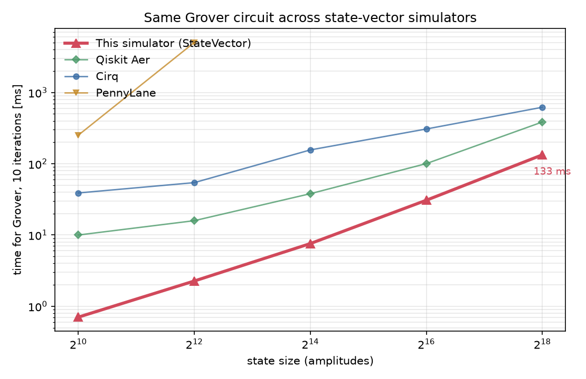


Same C++ core as v1.0, extended with five new tiers: superconducting hardware noise, pulse-level control and quantum trajectories, gate-level algorithms with error mitigation, quantum reservoir computing, and surface code error correction with lattice surgery.

v1.0 answered one question: how fast can a state vector be updated? v2.0 asks the question a hardware team asks next. What does the device do to that state, and how well can a code recover from it?

Every number in this section comes from a script in `benchmarks/`, a self-test inside the module that owns it, or a JSON file in `docs/`. The table in [Every headline number](#-every-headline-number) names the source of each one. Where a result is weaker than it looks, the text says so next to the number.

**Contents**

1. [Cross-library benchmark](#-cross-library-benchmark)
2. [Five tiers, one platform](#-five-tiers-one-platform)
3. [Architecture](#%EF%B8%8F-architecture)
4. [Complete file inventory](#-complete-file-inventory)
5. [Installation](#-installation)
6. [Build all modules](#-build-all-modules)
7. [Quick start: all five tiers](#-quick-start-all-five-tiers)
8. [Every headline number](#-every-headline-number)
9. [Comparison to other simulators](#-comparison-to-other-simulators)
10. [Key design decisions](#-key-design-decisions)
11. [Lessons learned](#-lessons-learned)
12. [v2.0 roadmap](#-v20-roadmap)
13. [Citation](#-citation-v20)
14. [References](#-references)

---

## 🏆 Cross-library benchmark


Same Grover circuit, 10 iterations, single marked state. Script: `benchmarks/compare_libraries.py`, raw data: `docs/library_comparison.json`.

| n | 2^n | Lightning-Lite | Qiskit Aer | Cirq | PennyLane |
|---|-----|---------------|-----------|------|-----------|
| 10 | 1,024 | **0.7 ms** | 10.0 ms | 38.9 ms | 251.8 ms |
| 12 | 4,096 | **2.3 ms** | 15.9 ms | 54.3 ms | 5,044.6 ms |
| 14 | 16,384 | **7.6 ms** | 38.0 ms | 156.4 ms | n/a |
| 16 | 65,536 | **30.8 ms** | 100.5 ms | 307.5 ms | n/a |
| 18 | 262,144 | **133.3 ms** | 385.6 ms | 620.8 ms | n/a |

**Speedup at n = 18:** 2.89× vs Qiskit Aer, 4.66× vs Cirq.
**Peak memory at n = 18:** 44 MB vs 109 MB (Aer) and 227 MB (Cirq).
Success probabilities match all libraries to 1.3×10⁻¹⁴.

"n/a" for PennyLane means the run did not finish: the process was killed at n = 14 (exit -15), so no larger size was attempted. Qulacs was skipped.

Test setup, so the numbers can be judged fairly: 2 CPU cores, 3 repeats per point, Qiskit Aer 0.17.2, Cirq 1.7.0, PennyLane 0.45.1. Every library runs in its default configuration.

Speedup over Qiskit Aer across the whole table:

| n | Lightning-Lite | Qiskit Aer | Speedup |
|---|----------------|-----------|---------|
| 10 | 0.7 ms | 10.0 ms | 14.29× |
| 12 | 2.3 ms | 15.9 ms | 6.91× |
| 14 | 7.6 ms | 38.0 ms | 5.00× |
| 16 | 30.8 ms | 100.5 ms | 3.26× |
| 18 | 133.3 ms | 385.6 ms | 2.89× |

The advantage shrinks as the state grows. At small n the cost is mostly fixed per-call overhead, where a thin pybind11 layer wins. At large n both simulators are limited by memory bandwidth, the same wall described in the v1.0 [Technical Deep Dive](#-technical-deep-dive).

**Two benchmarks, two machines, two results.** The v1.0 table at the top of this README (3.56× to 2.30× over Qiskit) used 1000 mixed H and CNOT gates on an 8-core machine. This table uses a Grover circuit on a 2-core machine. They measure different workloads, so neither replaces the other.

---

## 🎯 Five tiers, one platform

### Tier 1: Superconducting hardware noise

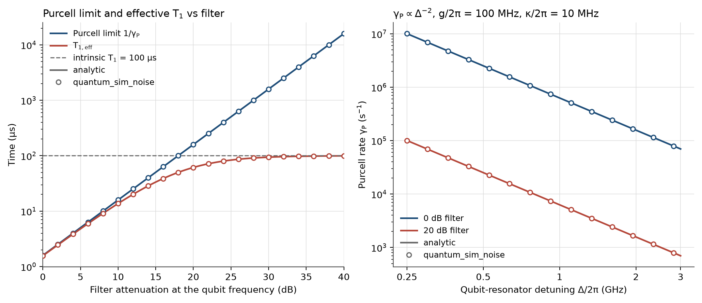
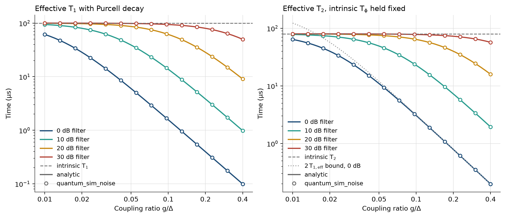

- `KrausChannel`: general CPTP maps, bit-block iteration (no 2ⁿ matrices)
- `T1T2Model`: relaxation and dephasing with Tphi preservation
- `PurcellModel`: dispersive-limit decay with π-filter suppression
- 13 checks pass to machine precision

**Physics implemented** (`src/Noise.h`, derivations in [HARDWARE_NOISE.md](docs/HARDWARE_NOISE.md)):

| Quantity | Expression |
|----------|-----------|
| Amplitude damping over time t | γ = 1 − exp(−t / T1) |
| Pure dephasing | λ = 1 − exp(−2t / Tφ), with 1/Tφ = 1/T2 − 1/(2·T1) |
| Purcell decay rate | γ_P = s · κ · (g / Δ)² |
| π-filter suppression | s = 10^(−dB / 10) |
| Combined channel | 1/T1_eff = 1/T1 + γ_P, 1/T2_eff = 1/(2·T1_eff) + 1/Tφ |

The last row is the reason `combined_with` exists. Adding a Purcell channel lowers T1 but must not change the pure-dephasing time Tφ, otherwise T2 would drift without anyone asking it to. Tφ is held fixed and T2 is recomputed.

A channel on `m` target qubits of an `n`-qubit density matrix gathers each 2ᵐ × 2ᵐ block by bit index, forms Σₖ Kₖ B Kₖ†, and scatters it back. No 2ⁿ × 2ⁿ operator is built, and the loop over blocks runs under OpenMP.

The validation uses T1 = 100 µs, T2 = 80 µs, g/2π = 100 MHz, Δ/2π = 1 GHz and κ/2π = 10 MHz. Reproduce it with:

```bash
python3 benchmarks/t1_t2_decay.py
```

The script prints the summary tables first, then writes the PNGs to `docs/images/`, and exits non-zero if any of the 13 checks fails. Raw output is in `docs/t1_t2_results.txt`.

### Tier 2: Algorithms, backends, error mitigation

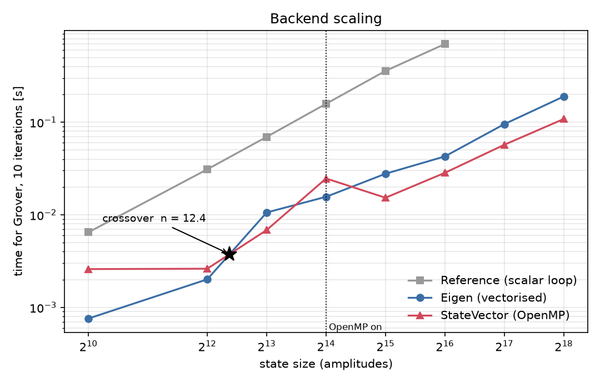
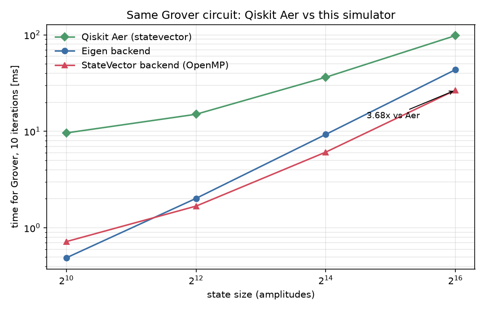
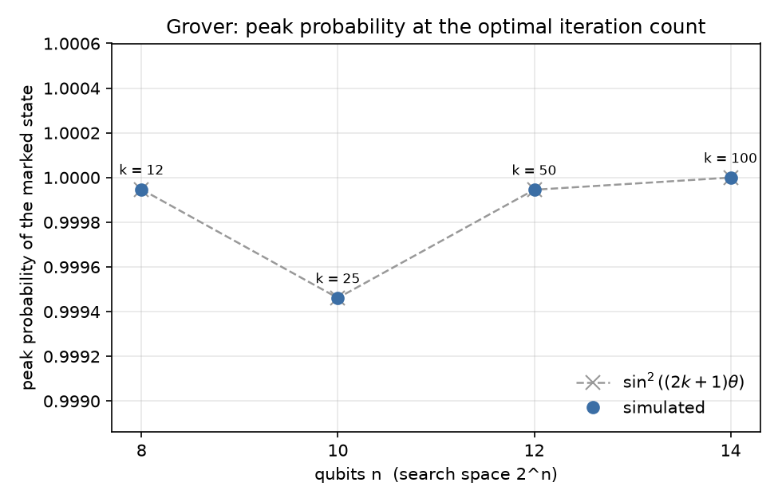
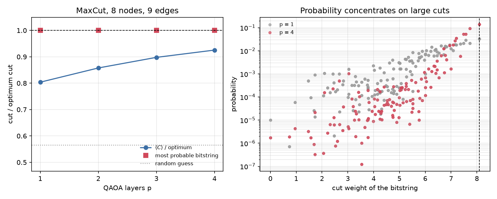
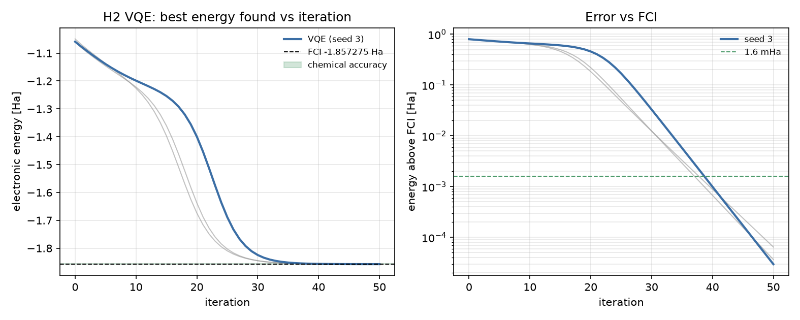

- Three interchangeable backends behind one `ll::Backend` interface: `ReferenceBackend` (scalar loop, up to 26 qubits), `EigenBackend` (vectorised, up to 24) and `StateVectorBackend` (OpenMP, up to 25)
- Crossover between Eigen and StateVector measured at n = 12.4
- Grover, QAOA and VQE written once against the interface, so they run on any backend
- Zero-noise extrapolation (ZNE) with Richardson weights over folded noise scales

The algorithms (`src/Algorithms.h`) never name a concrete backend. That is what makes the crossover measurement honest: the same Grover source, timed on each backend.

Measured crossover (`benchmarks/backend_crossover.py`, [backend_crossover.md](docs/backend_crossover.md)):

| n | Eigen (ms) | StateVector (ms) | Speedup | Winner |
|---|-----------|------------------|---------|--------|
| 10 | 1.2 | 5.7 | 0.22× | Eigen |
| 12 | 47.4 | 61.4 | 0.77× | Eigen |
| 14 | 389.0 | 310.5 | 1.25× | StateVector |
| 16 | 1294.6 | 976.1 | 1.33× | StateVector |
| 18 | 9340.9 | 6030.1 | 1.55× | StateVector |
| 20 | 87045.1 | 54518.6 | 1.60× | StateVector |

The fitted crossover is n = 12.38 (`docs/backend_crossover.json`). It is an interpolation of measured timings, not an integer: at n = 12 Eigen is faster and at n = 14 StateVector is. Below the crossover Eigen's SIMD wins because there is no thread start-up cost. Above it, OpenMP with cache-blocked iteration takes over. `StateVectorBackend` runs single-threaded below `PAR_MIN` amplitudes (see the header comment in `src/StateVectorBackend.h`), so small states do not pay for thread start-up.

Per-algorithm comparison of the two fast backends (`docs/algorithms_benchmark.json`):

| Algorithm | n | Eigen | StateVector | Speedup |
|-----------|---|-------|-------------|---------|
| Grover, 10 iterations | 16 | 52.2 ms | 33.1 ms | 1.58× |
| Grover, 10 iterations | 18 | 208.4 ms | 143.0 ms | 1.46× |
| QAOA, p = 3 | 16 | 13.7 ms | 13.7 ms | 1.00× |
| QAOA, p = 3 | 18 | 54.0 ms | 56.6 ms | 0.95× |
| VQE | 12 | 28.9 ms | 25.7 ms | 1.13× |
| VQE | 14 | 237.2 ms | 153.3 ms | 1.55× |

QAOA shows no gain from the OpenMP backend at these sizes; the table reports that as measured.

**Algorithm checks.** Grover at n = 8 with marked state 85 finds the state after 12 iterations with peak probability 0.99994704, matching theory to 3.4×10⁻¹⁴. VQE on H₂ at 0.735 Å (2 layers) reaches an energy error of 2.97×10⁻⁵ Ha after 50 iterations and 1.41×10⁻¹² Ha after 500.

**Error mitigation** (`src/Mitigation.h`, `src/Mitigation.cpp`): `NoisyBackend` wraps any backend and applies depolarizing noise after every gate by sampling a Pauli per noise site, so no 2ⁿ × 2ⁿ operator is needed and any backend works. `DensityNoiseBackend` gives the exact answer. `ZNE` folds gates to scales 1, 3, 5, … and extrapolates to zero noise with Richardson weights. The built-in test compares the sampled estimate with the exact one at p = 0.02, to within a stated number of standard errors, for a 3-qubit circuit.

### Tier 3: Pulse level control and trajectories


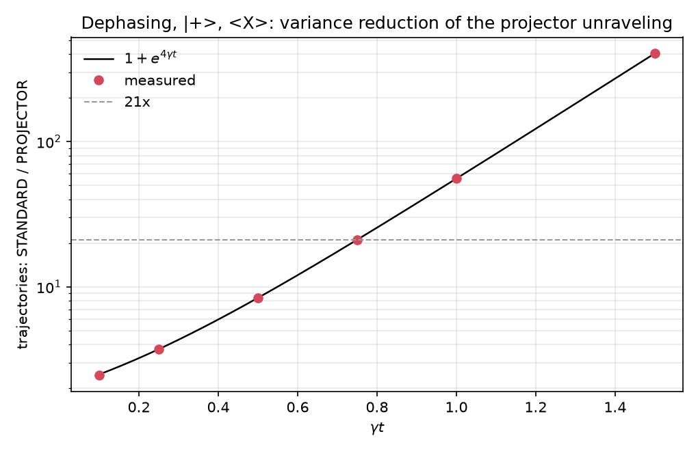

- Transmon Hamiltonian in the charge basis, RK4 propagator
- DRAG pulse: 108× leakage reduction at β = 1
- Lindblad master equation solver
- Three unravelings: STANDARD, PROJECTOR, ANALOG
- Projector unraveling: 405× variance reduction at γt = 1.5 (404.8 measured)

**Transmon model** (`src/Transmon.h`, [PULSE_LEVEL.md](docs/PULSE_LEVEL.md)). H = 4·E_C·(n̂ − n_g)² − E_J·cos φ̂ is diagonalised in the charge basis with `DEFAULT_CHARGE_CUTOFF = 40`. The lowest `n_levels` eigenstates (at least 3, so leakage to |2⟩ exists) form the working space. The anharmonicity tends to −E_C when E_J ≫ E_C, with a slowly vanishing √(E_C/E_J) correction that the code keeps. With E_J/E_C = 50 and E_C = 300 MHz the model gives f₀₁ ≈ 5.68 GHz and α ≈ −345 MHz.

Time evolution is fixed-step RK4. The step is chosen so that no step advances the fastest phase by more than `RK4_TARGET_PHASE_STEP = 0.01` rad. `DriveModel::RWA` drops the counter-rotating terms; `DriveModel::Full` keeps them but needs far more steps.

**DRAG results** (T = 8 ns, σ = 2 ns, `benchmarks/drag_leakage.py`):

| Result | Value |
|---|---|
| Leakage minimum | β = 1.05 |
| Leakage at β = 1 vs β = 0 | 108× lower |
| Leakage slopes (square / Gaussian / DRAG) | 1.99 / 4.02 / 8.26 |
| n_levels = 3 vs converged DRAG leakage | underestimates by about 2× |
| Coherent error at T = 60 ns | 4.3×10⁻⁴ (leakage about 4×10⁻¹⁵) |

Two things this table says that are easy to miss. First, three levels are not enough to study DRAG; use at least four (`leak_vs_nlevels` checks convergence). Second, at long pulse times the leakage is negligible and the remaining error is a coherent Stark-type shift, which first-order DRAG does not correct.

**Trajectories.** The Lindblad equation is solved directly and by Monte Carlo wave functions. The three unravelings sample the same master equation and are compared by the number of trajectories needed to reach a standard error of 0.005. For pure dephasing (L = Z, state |+⟩, observable ⟨X⟩), the variance reduction of PROJECTOR and ANALOG against STANDARD is:

| γt | PROJECTOR | ANALOG |
|----|-----------|--------|
| 0.10 | 2.5× | 9.8× |
| 0.25 | 3.7× | 7.6× |
| 0.50 | 8.4× | 8.9× |
| 0.75 | 21.1× | 12.8× |
| 1.00 | 55.7× | 18.9× |
| 1.50 | **404.8×** | 48.2× |

PROJECTOR follows its closed form, Var_PROJECTOR = m²(1 − m²)/(1 + m²) against Var_STANDARD = 1 − m², with m = exp(−2γt). The benchmark checks the measured ratio against it at every point. For amplitude damping the operator is not Pauli-like, PROJECTOR falls back to STANDARD, and the two agree exactly.

### Tier 4: Quantum reservoir computing

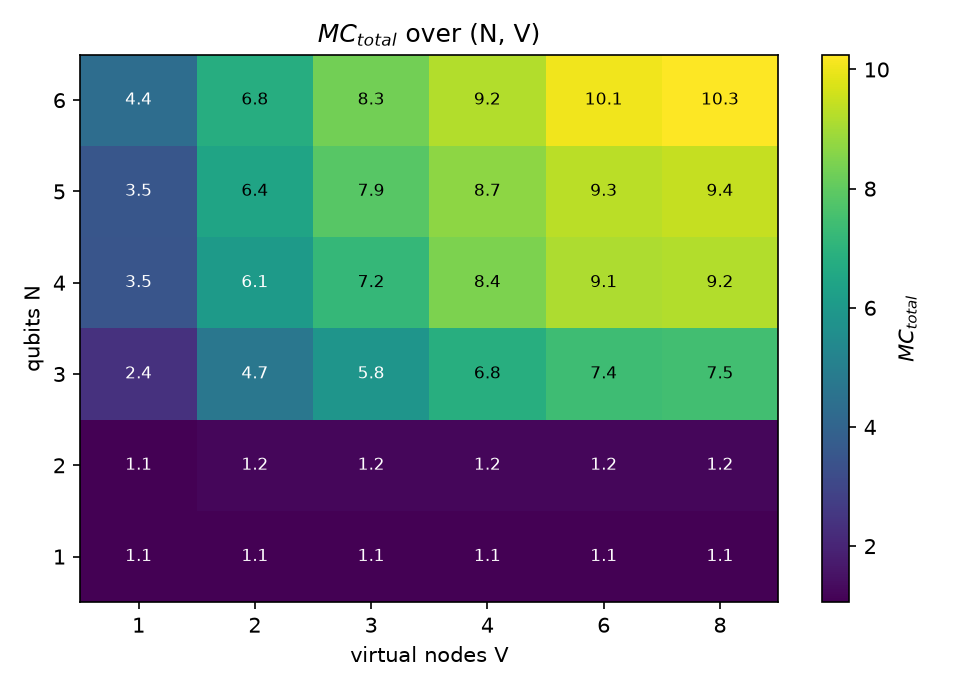
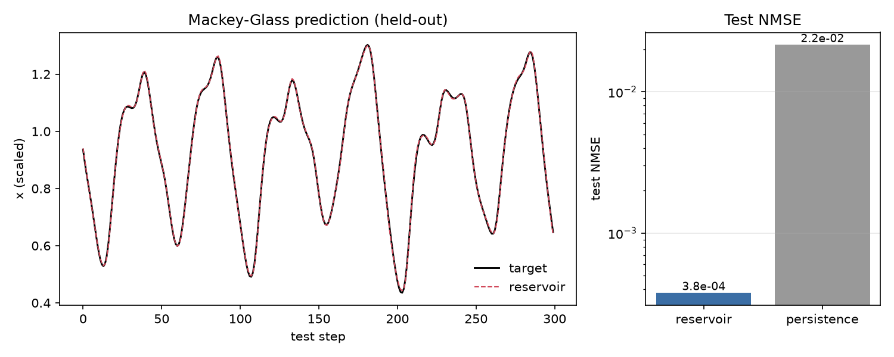
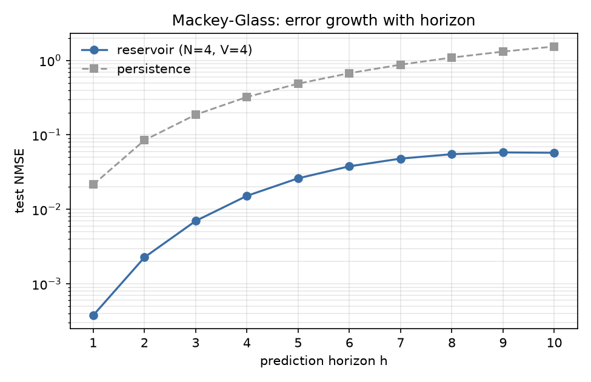

- Fujii-Nakajima time-multiplexed reservoir
- Memory capacity = 10.25 (N=6, V=8)
- Mackey-Glass: beats persistence at every horizon h = 1..10; beats a delay-embedded ridge baseline at h = 8..10
- Honest classical baseline reported

The reservoir (`src/Reservoir.h`, `python/qrc.py`, [QRC.md](docs/QRC.md)) injects the input into one qubit, evolves the system, and reads V virtual nodes per input step. Memory capacity follows Jaeger: the sum over delays of the squared correlation between the delayed input and its best linear reconstruction.

Memory capacity MC_total over qubits N and virtual nodes V (observable Z_i, seed 1):

| N \ V | 1 | 2 | 3 | 4 | 6 | 8 |
|-------|-----|-----|-----|-----|------|------|
| 1 | 1.1 | 1.1 | 1.1 | 1.1 | 1.1 | 1.1 |
| 2 | 1.1 | 1.2 | 1.2 | 1.2 | 1.2 | 1.2 |
| 3 | 2.4 | 4.7 | 5.8 | 6.8 | 7.4 | 7.5 |
| 4 | 3.5 | 6.1 | 7.2 | 8.4 | 9.1 | 9.2 |
| 5 | 3.5 | 6.4 | 7.9 | 8.7 | 9.3 | 9.4 |
| 6 | 4.4 | 6.8 | 8.3 | 9.2 | 10.1 | 10.3 |

The best cell, N = 6 and V = 8, has MC_total = 10.25 against a bound of 48 features. N = 1 sits at about 1.1 because H = hZ commutes with the measured Z, so one qubit remembers only the last input. Capacity saturates in V (from V = 6 to V = 8 the gain is at most 0.2) because the sub-step measurements are strongly correlated.

Mackey-Glass (τ = 17, 3000 samples, washout 200, 1500 training rows), one-step prediction with N = 4, V = 4:

| Metric | Value |
|--------|-------|
| NMSE, train | 3.90×10⁻⁴ |
| NMSE, test | 3.78×10⁻⁴ |
| NMSE, persistence baseline (test) | 2.15×10⁻² |
| Improvement over persistence | 56.9× |

Persistence is a weak baseline, so the benchmark also runs a classical delay-embedded ridge regression on the identical split. That comparison is less flattering and is reported as is: the delay-ridge baseline wins at short horizon, the reservoir overtakes it near h = 7, and the reservoir wins at h = 8..10. That is one seed with an untuned baseline, so read it as an observation and not a general claim. There is also no comparison against a classical echo-state network of equal feature count, so no quantum advantage is claimed.

### Tier 5: Error correction


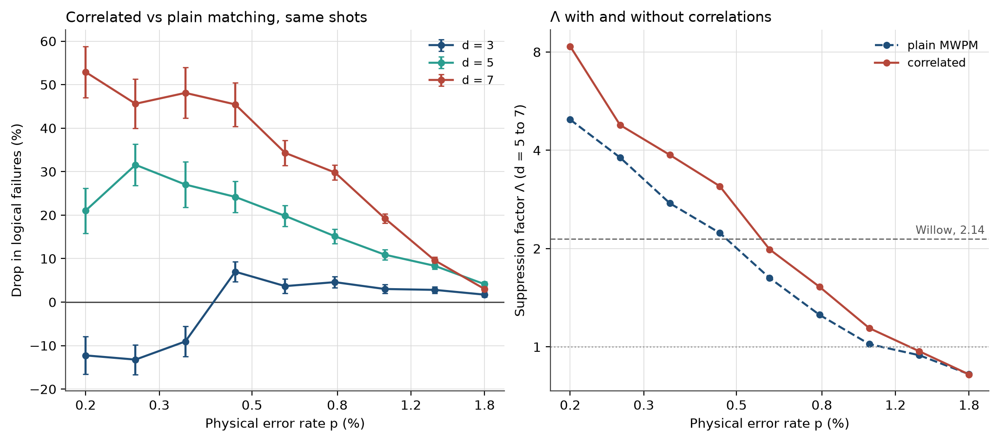

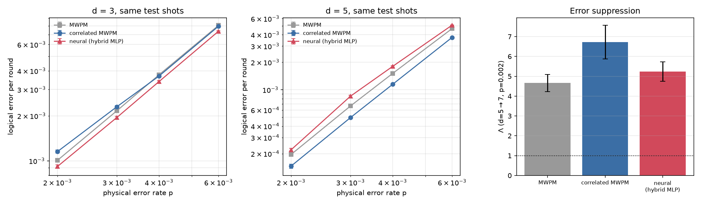
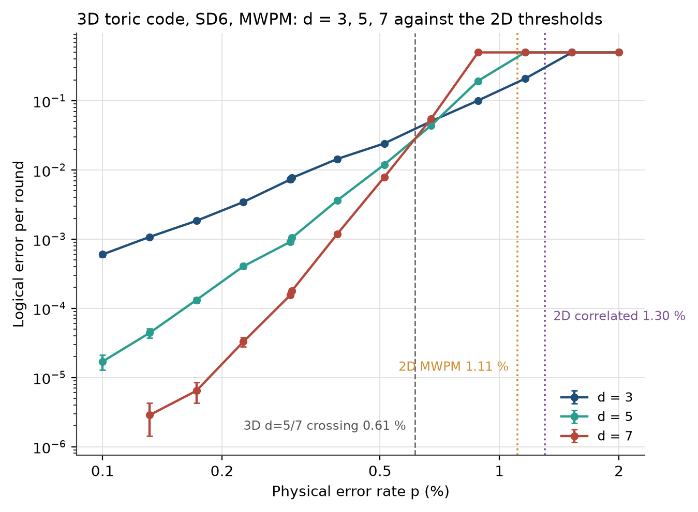

- 2D surface code: threshold 1.30% (correlated MWPM, d = 5/7 crossing)
- Correlated MWPM: Λ(5→7) = 7.70 at p = 0.2%
- Lattice surgery logical CNOT: error falls 3.23× from d = 3 to d = 5
- Neural decoder: beats MWPM at d = 3, falls behind it at d = 5
- 3D toric code (z sector): circuit-level threshold 0.61%

The full write-ups are [QEC.md](docs/QEC.md), [LATTICE_SURGERY.md](docs/LATTICE_SURGERY.md) and [THREE_D_SURFACE_CODE.md](docs/THREE_D_SURFACE_CODE.md).

#### 2D rotated surface code under SD6 noise (`src/SurfaceCode.py`)

Circuits come from Stim (`surface_code:rotated_memory_z`) with SD6 circuit-level depolarizing noise and `d` rounds of syndrome extraction. The detector error model is built with `decompose_errors=True`, so every mechanism is a graph edge. Decoding uses PyMatching.

The per-round logical error ε comes from 1 − 2·P_L = (1 − 2ε)^rounds. Λ is the suppression per distance step, Λ = ε_d / ε_{d+2}.

Default scan at p = 0.003:

| d | shots | failures | P_L | ε per round |
|---|-------|----------|-----|-------------|
| 3 | 50,000 | 307 | 6.140×10⁻³ | 2.055×10⁻³ ± 1.2×10⁻⁴ |
| 5 | 100,000 | 371 | 3.710×10⁻³ | 7.442×10⁻⁴ ± 3.9×10⁻⁵ |
| 7 | 150,000 | 212 | 1.413×10⁻³ | 2.021×10⁻⁴ ± 1.4×10⁻⁵ |

| Quantity | Value |
|----------|-------|
| Λ (3→5) | 2.761 ± 0.213 |
| Λ (5→7) | 3.681 ± 0.317 |
| Λ (weighted fit) | 3.153 ± 0.140 |
| d = 7 logical lifetime | 2720.2 µs vs 68.0 µs physical (ratio 40.00 ± 2.75, above breakeven) |
| Willow reference | Λ = 2.14 ± 0.02 |

The simulated Λ is higher than Willow's, and that does not mean this code beats Google's. SD6 is uniform depolarizing noise at one p; Willow runs hardware-shaped noise. The two are not comparable at equal p, and Λ is largely a function of how far p sits below threshold. The Willow figures are quoted from memory and should be checked against the paper before they are cited.

#### Correlated MWPM (`benchmarks/qec_correlated.py`)

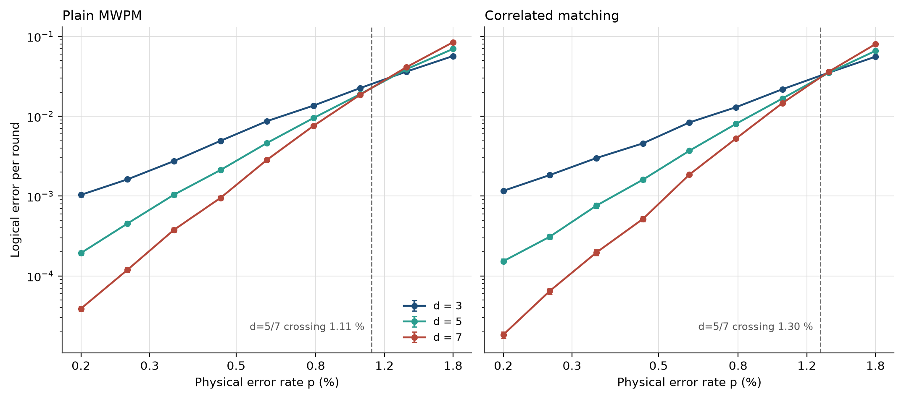

A Y error flips both an X-type and a Z-type check. Plain matching treats the two halves as unrelated events. Correlated matching (Fowler, arXiv:1310.0863) matches once, reweights the edges that share a Y-type mechanism with the first matching, and matches again (PyMatching `enable_correlations`). It is a heuristic, not an exact decoder.

The comparison is paired. Both decoders see identical shots, so differences are not sampling noise. Significance is the McNemar statistic z = (b − c)/√(b + c) over shots where exactly one decoder fails.

Per-round logical error, plain MWPM | correlated (`--quick` run: up to 60,000 shots or 60 plain-MWPM failures per point):

| p | d=3 MWPM | d=3 corr | d=5 MWPM | d=5 corr | d=7 MWPM | d=7 corr |
|---|----------|----------|----------|----------|----------|----------|
| 0.0020 | 1.042e-03 | 1.163e-03 | 2.035e-04 | 1.835e-04 | 4.287e-05 | 2.381e-05 |
| 0.0026 | 1.632e-03 | 1.927e-03 | 5.050e-04 | 3.485e-04 | 1.430e-04 | 6.669e-05 |
| 0.0035 | 2.742e-03 | 2.991e-03 | 1.040e-03 | 7.583e-04 | 3.550e-04 | 2.146e-04 |
| 0.0046 | 4.915e-03 | 4.568e-03 | 2.118e-03 | 1.602e-03 | 9.482e-04 | 5.159e-04 |
| 0.0060 | 8.676e-03 | 8.352e-03 | 4.625e-03 | 3.694e-03 | 2.845e-03 | 1.858e-03 |
| 0.0079 | 1.359e-02 | 1.295e-02 | 9.498e-03 | 8.013e-03 | 7.576e-03 | 5.245e-03 |
| 0.0104 | 2.248e-02 | 2.177e-02 | 1.887e-02 | 1.667e-02 | 1.851e-02 | 1.461e-02 |
| 0.0137 | 3.625e-02 | 3.515e-02 | 3.887e-02 | 3.510e-02 | 4.122e-02 | 3.619e-02 |
| 0.0180 | 5.673e-02 | 5.563e-02 | 6.974e-02 | 6.584e-02 | 8.455e-02 | 7.995e-02 |

Drop in logical failures from correlated matching on identical shots, (failures_MWPM − failures_corr) / failures_MWPM, with the McNemar z. Negative means correlated is worse:

| p | d=3 | d=5 | d=7 |
|---|-----|-----|-----|
| 0.0020 | −11.5 % [z −1.9] | +9.8 % [z +0.8] | +44.4 % [z +1.9] |
| 0.0026 | −18.0 % [z −3.8] | +31.0 % [z +3.7] | +53.3 % [z +4.5] |
| 0.0035 | −9.0 % [z −2.6] | +27.0 % [z +5.2] | +39.5 % [z +4.8] |
| 0.0046 | +7.0 % [z +3.1] | +24.2 % [z +6.7] | +45.5 % [z +9.1] |
| 0.0060 | +3.7 % [z +2.2] | +19.8 % [z +8.4] | +34.3 % [z +11.9] |
| 0.0079 | +4.6 % [z +3.6] | +15.1 % [z +9.2] | +29.8 % [z +17.2] |
| 0.0104 | +3.0 % [z +3.0] | +10.9 % [z +9.6] | +19.3 % [z +17.7] |
| 0.0137 | +2.8 % [z +3.8] | +8.3 % [z +10.7] | +9.6 % [z +12.6] |
| 0.0180 | +1.7 % [z +3.0] | +4.1 % [z +7.1] | +3.0 % [z +5.2] |

Λ(p), plain | correlated:

| p | 3→5 MWPM | 3→5 corr | 5→7 MWPM | 5→7 corr | ratio 5→7 |
|---|----------|----------|----------|----------|-----------|
| 0.0020 | 5.12 | 6.34 | 4.75 | **7.70** | 1.62 |
| 0.0026 | 3.23 | 5.53 | 3.53 | 5.23 | 1.48 |
| 0.0035 | 2.64 | 3.94 | 2.93 | 3.53 | 1.21 |
| 0.0046 | 2.32 | 2.85 | 2.23 | 3.11 | 1.39 |
| 0.0060 | 1.88 | 2.26 | 1.63 | 1.99 | 1.22 |
| 0.0079 | 1.43 | 1.62 | 1.25 | 1.53 | 1.22 |
| 0.0104 | 1.19 | 1.31 | 1.02 | 1.14 | 1.12 |
| 0.0137 | 0.93 | 1.00 | 0.94 | 0.97 | 1.03 |
| 0.0180 | 0.81 | 0.84 | 0.82 | 0.82 | 1.00 |

Threshold, estimated as the crossing of the ε(p) curves (16–84 % interval from resampling):

| Pair | Plain MWPM | Correlated |
|------|-----------|-----------|
| d = 5 / 7 | 1.11 % [1.04, 1.17] | **1.30 %** [1.27, 1.33] |
| d = 3 / 7 | 1.23 % [1.21, 1.24] | 1.34 % [1.33, 1.36] |

Cost, decoding time per 1000 shots summed over the sweep:

| d | Plain MWPM | Correlated | Slowdown |
|---|-----------|-----------|----------|
| 3 | 0.000 s | 0.001 s | 3.0× |
| 5 | 0.005 s | 0.012 s | 2.6× |
| 7 | 0.017 s | 0.044 s | 2.6× |

Two caveats show up in the tables above:

1. At d = 3 and p ≤ 0.35 %, correlated matching is significantly worse (z = −3.8 at p = 0.26 %). The cause has not been isolated. The working hypothesis is that on the smallest code the second pass can reinforce a wrong first matching. That is a hypothesis, not a finding.
2. Because of (1), Λ(5→7) is the clean figure to quote, not the d = 3 data.

A negative control (reset and measurement flips only, d = 5, p = 0.01, 50,000 shots) has no Y-type mechanisms, so the two decoders must agree. They do: 25 failures each and 0 shots where only one decoder fails.

#### Lattice surgery logical CNOT (`src/LatticeSurgery.py`)


A logical CNOT between two surface-code patches by lattice surgery, simulated end to end in Stim: prepare, a ZZ merge with an auxiliary patch, split, an XX merge, split, and a Pauli frame that carries the random measurement outcomes. The schedule is the textbook three-patch, three-measurement version. It is not the compact AuxCNOT schedule.

**Correctness is checked exactly.** At p = 0, the CNOT truth table holds on all four Z-basis and all four X-basis inputs, in both decoding sectors, with 0 failures out of 8 rows. The frame is observed both acting and not acting, the uncorrected readout is wrong in some shots while the frame-corrected readout is never wrong, and every detector is deterministic.

**Noise results** (SD6, p = 0.002, MWPM, 20,000 shots per sector, `rounds = d`):

| d | CNOT error (z + x sectors) |
|---|---|
| 3 | 5.88×10⁻² ± 1.7×10⁻³ |
| 5 | 1.82×10⁻² ± 9.5×10⁻⁴ |

The ratio is 3.23 ± 0.19. Read it carefully: it is a single step from d = 3 to d = 5, two points, and not a fitted Λ. It shows the error falling with distance, which means p = 0.002 is below threshold for this circuit. It is a CNOT error per gate (both merges plus preparation), so it cannot be compared with the per-round memory Λ above. The z + x sum is an upper bound on a random CNOT being wrong, not an average process infidelity.

#### Neural decoder (`src/NeuralDecoder.py`, `benchmarks/qec_neural.py`)


A hybrid decoder: an MLP takes the syndrome and the MWPM prediction m(s) as input, and its output is added to a residual path α·(2m − 1) with a learnable gain, initialised so training starts at (a recalibrated) MWPM and moves away only where the data supports it. Loss is binary cross-entropy per observable. One decoder is trained per (d, p) on fresh shots of the exact circuit, then plain MWPM, correlated MWPM and the neural decoder all decode the same held-out shots with different seeds.

What the figure shows (values are read from the plot):

| Distance | Result |
|----------|--------|
| d = 3 | the neural decoder is at or below MWPM across p = 0.002 to 0.006 |
| d = 5 | the neural decoder is above MWPM; correlated MWPM is best |
| Λ(5→7) at p = 0.002 | about 4.7 (MWPM), 6.7 (correlated), 5.2 (neural) |

So the honest summary is: it beats MWPM at d = 3, it does not at d = 5, and at d = 5 and 7 correlated matching is the better decoder. The reason is data. The syndrome space has 2^D states (D about 24 at d = 3, over 100 at d = 5) and the network sees a vanishing fraction of it. The benchmark requires no result in the neural decoder's favour, and a decoder is valid only for the (distance, rounds, p, noise) it was trained on. This is a small stand-in for Google's recurrent transformer, not a replica.

#### 3D toric code (`src/ThreeDSurfaceCode.py`, `benchmarks/qec_3d.py`)


A standard 3D toric code memory with k = 3 logical qubits, simulated at circuit level (SD6) and decoded with MWPM. Only **sector z** has a built-in decoder, so the benchmark covers that sector. The two sectors are simulated in separate circuits, so correlations between them are not modelled.

| Quantity | Value |
|---|---|
| Threshold, d = 5/7 crossing | 0.61 % [0.60, 0.62] |
| Threshold, d = 3/5 crossing | 0.71 % [0.69, 0.72] |
| Λ(3→5) at p = 0.3 % | 7.36 |
| Λ(5→7) at p = 0.3 % | 5.81 |

The d = 3/5 crossing sits above the d = 5/7 one, so the estimate is still moving with d. Treat 0.61 % as an estimate for this lattice size, not the asymptotic threshold. The lattice is a torus, not a planar patch with boundaries.

| Code | Decoder | Circuit-level threshold (SD6) |
|---|---|---|
| 2D surface code | plain MWPM | 1.11 % |
| 2D surface code | correlated MWPM | 1.30 % |
| 3D toric code, sector z | MWPM | 0.61 % (d = 5/7) |

The 3D threshold is about 0.55 times the 2D plain-MWPM value and about 0.47 times the 2D correlated value. Do not compare it with literature code-capacity thresholds for the 3D code: that is a different quantity (perfect measurement, optimal decoding).

---

## 🛠️ Architecture

```
┌──────────────────────────────────────────────────────────────────────────┐
│                              PYTHON LAYER                                │
│                                                                          │
│  noise_models.py   pulse.py   trajectory.py   algorithms.py   qrc.py     │
│  gate_fusion.py                                                          │
│                                                                          │
│  SurfaceCode.py   LatticeSurgery.py   NeuralDecoder.py   ThreeDSurface-  │
│  (Stim + PyMatching)  (Stim)          (PyTorch)          Code.py (Stim)  │
│                                                                          │
│  benchmarks/*.py  ->  tables on stdout first, then PNGs in docs/images/  │
└───────────────────────────────────┬──────────────────────────────────────┘
                                    │  pybind11, zero-copy NumPy views
┌───────────────────────────────────▼──────────────────────────────────────┐
│                          pybind11 BRIDGE                                 │
│                                                                          │
│  bindings_v2.cpp        bindings_noise.cpp       bindings_pulse.cpp      │
│  bindings_algorithms.cpp   bindings_mitigation.cpp                       │
│  bindings_trajectory.cpp   bindings_qrc.cpp                              │
└───────────────────────────────────┬──────────────────────────────────────┘
                                    │
┌───────────────────────────────────▼──────────────────────────────────────┐
│                  Backend.h : one interface, three backends               │
│                                                                          │
│   ReferenceBackend      EigenBackend          StateVectorBackend         │
│   (scalar, <= 26 q)     (SIMD, <= 24 q)       (OpenMP, <= 25 q)          │
│                                                                          │
│   Algorithms.h (Grover, QAOA, VQE)      Mitigation.h (ZNE)               │
└───────────────────────────────────┬──────────────────────────────────────┘
                                    │
┌───────────────────────────────────▼──────────────────────────────────────┐
│                              C++17 CORE                                  │
│                                                                          │
│  StateVector / StateVectorOptimized     Noise.h  KrausChannel, T1T2Model,│
│  (cache blocked, gate fusion, OpenMP)   PurcellModel                     │
│                                                                          │
│  Transmon.h/.cpp   DRAG.cpp   SchrodingerSolver.cpp                      │
│  TrajectorySolver.h/.cpp (Lindblad, 3 unravelings)                       │
│  Reservoir.h (quantum reservoir computing)                               │
└──────────────────────────────────────────────────────────────────────────┘
```

Two rules hold across the layers:

- **Heavy numerics stay in C++** (gate application, channels, propagators, reservoirs). Error correction runs in Python on top of Stim and PyMatching, which are already compiled, so there is nothing to gain from re-implementing them.
- **No operator is ever built at the size of the Hilbert space.** Channels act on bit blocks, the propagator acts on a small level space, and the state vector is updated in place. The one place a dense matrix appears is the density-matrix side (Tier 1, Tier 4), which is capped by design.

---

## 📁 Complete file inventory

Line counts are from the repository at the commit that introduced the cross-library benchmark. Files from v1.0 are listed in [Project Structure](#-project-structure) above and are unchanged unless noted.

### `src/`

| File | Lines | Tier | Purpose |
|------|------:|------|---------|
| `Noise.h` | 301 | 1 | `KrausChannel`, `T1T2Model`, `PurcellModel` declarations |
| `Noise.cpp` | 745 | 1 | Channel implementation and `LL_TEST` block |
| `bindings_noise.cpp` | 146 | 1 | pybind11 module `quantum_sim_noise` |
| `Backend.h` | 149 | 2 | Common interface and `ReferenceBackend` |
| `EigenBackend.h` | 157 | 2 | Vectorised backend |
| `StateVectorBackend.h` | 222 | 2 | OpenMP, cache-blocked backend |
| `Algorithms.h` | 314 | 2 | Grover, QAOA, VQE against `Backend` |
| `bindings_algorithms.cpp` | 123 | 2 | pybind11 module `quantum_sim_algorithms` |
| `Mitigation.h` | 717 | 2 | `NoisyBackend`, `DensityNoiseBackend`, `ZNE` |
| `Mitigation.cpp` | 534 | 2 | Mitigation test program |
| `bindings_mitigation.cpp` | 171 | 2 | pybind11 module `quantum_sim_mitigation` |
| `Transmon.h` | 245 | 3 | Charge-basis transmon, `DrivePulse`, `Envelope` |
| `Transmon.cpp` | 485 | 3 | Hamiltonian, RK4 propagator, leakage, tests |
| `DRAG.cpp` | 264 | 3 | Gaussian, DRAG and square envelopes, tests |
| `SchrodingerSolver.cpp` | 421 | 3 | Lindblad solver, tests |
| `bindings_pulse.cpp` | 297 | 3 | pybind11 module `quantum_sim_pulse` |
| `TrajectorySolver.h` | 792 | 3 | STANDARD, PROJECTOR, ANALOG unravelings |
| `TrajectorySolver.cpp` | 126 | 3 | Trajectory demo |
| `bindings_trajectory.cpp` | 133 | 3 | pybind11 module `quantum_sim_trajectory` |
| `Reservoir.h` | 829 | 4 | Time-multiplexed reservoir, readout, 22 checks |
| `bindings_qrc.cpp` | 114 | 4 | pybind11 module `quantum_sim_qrc` |
| `SurfaceCode.py` | 630 | 5 | Surface code memory, MWPM, correlated MWPM, Λ |
| `LatticeSurgery.py` | 928 | 5 | Logical CNOT by lattice surgery |
| `NeuralDecoder.py` | 312 | 5 | Hybrid MLP + MWPM decoder |
| `ThreeDSurfaceCode.py` | 644 | 5 | 3D toric code, circuit-level threshold |

### `python/`

| File | Lines | Purpose |
|------|------:|---------|
| `noise_models.py` | 544 | `T1T2Model`, `PurcellModel`, `NoiseModel`, `DensityMatrixSimulator`, analytic references |
| `pulse.py` | 113 | Transmon, DRAG pulses, β sweep, level convergence |
| `trajectory.py` | 362 | Qubit builders, estimators, variance reduction, plots |
| `algorithms.py` | 230 | `run_grover`, `run_maxcut`, `run_vqe`, backend selection |
| `qrc.py` | 210 | Reservoir driver, memory capacity, Mackey-Glass |
| `gate_fusion.py` | 85 | v1.0 fusion optimizer |

### `benchmarks/`

| File | Lines | Purpose |
|------|------:|---------|
| `t1_t2_decay.py` | 444 | Tier 1: 13 validation checks, T1, T2, Purcell sweep |
| `compare_libraries.py` | 613 | Cross-library Grover benchmark |
| `algorithms_benchmark.py` | 543 | Grover, QAOA, VQE on both fast backends |
| `algorithms_vs_qiskit.py` | 299 | Grover vs Qiskit Aer, three simulators |
| `backend_crossover.py` | 257 | Eigen vs StateVector crossover, thread sweep |
| `grover_demo.py` | 270 | 4-qubit walkthrough, 8-qubit run, backend comparison |
| `drag_leakage.py` | 217 | DRAG β sweep and convergence |
| `trajectory_variance.py` | 380 | Variance reduction, trajectories needed, scaling |
| `qrc_mackey_glass.py` | 283 | Memory capacity grid, Mackey-Glass, delay-ridge baseline |
| `qec_threshold.py` | 350 | Threshold and Λ scan, plain MWPM |
| `qec_correlated.py` | 405 | Paired plain vs correlated sweep and negative control |
| `qec_lattice_surgery.py` | 44 | CNOT error figure |
| `qec_neural.py` | 230 | Neural vs MWPM vs correlated |
| `qec_3d.py` | 436 | 3D toric code threshold sweep |

### `docs/` and `tests/`

| File | Lines | Content |
|------|------:|---------|
| `HARDWARE_NOISE.md` | 212 | Tier 1 derivations and the 13 checks |
| `PULSE_LEVEL.md` | 244 | Transmon, DRAG, Lindblad, trajectories |
| `QRC.md` | 188 | Reservoir design and results |
| `QEC.md` | 176 | Surface code memory, threshold, Λ, Willow comparison |
| `LATTICE_SURGERY.md` | 220 | Protocol, truth table, CNOT error vs distance |
| `THREE_D_SURFACE_CODE.md` | 185 | 3D toric code construction and threshold |
| `backend_crossover.md` | 23 | Crossover table |
| `tests/test_backends.cpp` | 315 | Reference vs Eigen backend cross-check |

Raw results sit next to the docs as JSON: `library_comparison.json`, `algorithms_benchmark.json`, `algorithms_vs_qiskit.json`, `backend_crossover.json`, `trajectory_benchmark.json`, `qec_3d_benchmark.json`.

### `docs/images/`

| Image | Produced by |
|-------|-------------|
| `library_comparison.png` | `compare_libraries.py` |
| `purcell_filter_detuning.png`, `combined_t1_t2_eff.png`, `t1_t2_decay.png` | `t1_t2_decay.py` |
| `backend_crossover.png`, `backend_crossover_t1.png`, `backend_crossover_t2.png`, `thread_scaling.png` | `backend_crossover.py` |
| `algorithms_backend_comparison.png`, `grover_scaling.png`, `qaoa_maxcut.png`, `vqe_h2_convergence.png` | `algorithms_benchmark.py` |
| `algorithms_vs_qiskit.png` | `algorithms_vs_qiskit.py` |
| `grover_demo.png` | `grover_demo.py` |
| `drag_beta_sweep.png`, `drag_vs_gaussian.png`, `leakage_vs_omega.png`, `nlevels_convergence.png`, `stark_shift.png` | `drag_leakage.py` |
| `trajectory_variance_reduction.png`, `trajectory_n_required.png`, `trajectory_scaling.png` | `trajectory_variance.py` |
| `qrc_mc_heatmap.png`, `qrc_mc_vs_qubits.png`, `qrc_features.png`, `qrc_mg_prediction.png`, `qrc_mg_horizon.png` | `qrc_mackey_glass.py` |
| `qec_threshold.png`, `qec_suppression.png` | `qec_threshold.py` |
| `qec_correlated_gain.png`, `qec_correlated_threshold.png` | `qec_correlated.py` |
| `qec_lattice_surgery.png` | `qec_lattice_surgery.py` |
| `qec_neural_decoder.png` | `qec_neural.py` |
| `qec_3d_threshold.png` | `qec_3d.py` |

---

## 🚀 Installation

### System packages (Debian / Ubuntu)

```bash
sudo apt update
sudo apt install -y build-essential g++ git python3 python3-dev python3-pip \
                    libeigen3-dev libomp-dev
```

### Python packages

```bash
# Core
pip install numpy scipy matplotlib pybind11

# Tier 5 (error correction)
pip install stim pymatching

# Tier 5 neural decoder (only needed to train or benchmark it)
pip install torch

# Cross-library benchmark and Qiskit comparisons (optional)
pip install qiskit qiskit-aer cirq pennylane psutil
```

On a distribution whose Python is externally managed, add `--break-system-packages` or use a virtual environment.

### Check the environment

```bash
python3 -c "import numpy, scipy, stim, pymatching, pybind11; print('stim', stim.__version__, '| pymatching', pymatching.__version__, '| pybind11', pybind11.__version__)"
g++ --version
ls /usr/include/eigen3/Eigen/Dense && echo "Eigen found"
```

---

## 🔨 Build all modules

Each binding file carries its own build command in its header comment. They are collected here. Run everything from the repository root.

```bash
mkdir -p build
PYINC="$(python3 -m pybind11 --includes)"
EXT="$(python3-config --extension-suffix)"
LDF="$(python3-config --ldflags)"
EIG="-I/usr/include/eigen3"
```

**v1.0 modules** (unchanged, commands in [Build from Source](#build-from-source) above).

**Tier 1: hardware noise** (`quantum_sim_noise`):

```bash
g++ -O3 -shared -std=c++17 -fopenmp -fPIC $EIG $PYINC \
    src/Noise.cpp src/bindings_noise.cpp \
    -o build/quantum_sim_noise$EXT
```

**Tier 2: algorithms and mitigation**:

```bash
# Algorithms
g++ -O3 -shared -std=c++17 -fopenmp -march=native -fPIC $EIG $PYINC \
    src/bindings_algorithms.cpp \
    -o build/quantum_sim_algorithms$EXT $LDF

# Mitigation (needs Noise.o)
g++ -O2 -std=c++17 -fopenmp $EIG -c src/Noise.cpp -o build/Noise.o
g++ -O3 -shared -std=c++17 -fopenmp -fPIC $EIG $PYINC \
    src/bindings_mitigation.cpp build/Noise.o \
    -o build/quantum_sim_mitigation$EXT $LDF
```

**Tier 3: pulse level and trajectories**:

```bash
# Pulse (compile WITHOUT -DLL_TEST: each .cpp has its own test main)
g++ -O2 -std=c++17 -shared -fPIC -fopenmp $PYINC $EIG \
    src/bindings_pulse.cpp src/Transmon.cpp src/DRAG.cpp src/SchrodingerSolver.cpp \
    -o build/quantum_sim_pulse$EXT

# Trajectories
g++ -O3 -Wall -shared -std=c++17 -fopenmp -fPIC $EIG -Isrc $PYINC \
    src/bindings_trajectory.cpp \
    -o build/quantum_sim_trajectory$EXT $LDF
```

**Tier 4: quantum reservoir computing**:

```bash
g++ -O3 -Wall -shared -std=c++17 -fPIC $EIG $PYINC \
    src/bindings_qrc.cpp \
    -o build/quantum_sim_qrc$EXT $LDF
```

**Tier 5** is pure Python and needs nothing compiled.

### Unit tests

```bash
# Noise (13 checks are enforced by benchmarks/t1_t2_decay.py)
g++ -O2 -std=c++17 -fopenmp -DLL_TEST $EIG src/Noise.cpp -o build/noise_test && ./build/noise_test

# Mitigation
g++ -O2 -std=c++17 -fopenmp -DLL_TEST $EIG src/Mitigation.cpp src/Noise.cpp -o build/mitigation_cpp_test
./build/mitigation_cpp_test

# Pulse level (Transmon.o is compiled WITHOUT -DLL_TEST)
g++ -O2 -std=c++17 $EIG -c src/Transmon.cpp -o build/Transmon.o
g++ -O2 -std=c++17 -DLL_TEST $EIG src/Transmon.cpp -o build/transmon_test && ./build/transmon_test
g++ -O2 -std=c++17 -DLL_TEST $EIG src/DRAG.cpp build/Transmon.o -o build/drag_test && ./build/drag_test
g++ -O2 -std=c++17 -DLL_TEST $EIG src/SchrodingerSolver.cpp build/Transmon.o -o build/solver_test && ./build/solver_test

# Reservoir (22 checks)
g++ -O2 -std=c++17 -DLL_TEST $EIG -x c++ src/Reservoir.h -o build/reservoir_test && ./build/reservoir_test

# Backends: Reference vs Eigen
g++ -O2 -std=c++17 $EIG -Isrc tests/test_backends.cpp -o build/test_backends && ./build/test_backends

# Tier 5 self-tests
python3 src/SurfaceCode.py
python3 src/LatticeSurgery.py
python3 src/ThreeDSurfaceCode.py
```

Each C++ test exits with code 0 when every check passes.

---

## ⚡ Quick start: all five tiers

All snippets run from the repository root after the build step above.

### 1. Hardware noise (Tier 1)

```python
import sys
sys.path[:0] = ["python", "build"]

import noise_models as nm

T1, T2 = 100e-6, 80e-6

# 20 dB pi-filter, parameters in cyclic Hz
purcell = nm.purcell_from_frequencies(g_hz=100e6, delta_hz=1e9, kappa_hz=10e6, filter_db=20.0)
print(purcell.rate(), purcell.t1_limit())

eff = purcell.combined_with(nm.T1T2Model(T1, T2))
print(eff.t1(), eff.t2(), eff.t_phi())          # t_phi is unchanged by the Purcell channel

# Two-qubit Bell state with decoherence and gate error
noise = nm.NoiseModel.uniform(2, T1, T2, purcell=purcell, p1q=5e-4, p2q=5e-3)
sim = nm.DensityMatrixSimulator(2, noise)
sim.gate("H", 0)
sim.gate("CNOT", 0, 1)
sim.idle(20e-6)
```

The full validation, with tables, is `python3 benchmarks/t1_t2_decay.py`.

### 2. Algorithms and backends (Tier 2)

```python
import sys
sys.path[:0] = ["python", "build"]

from algorithms import Backend, run_grover, run_maxcut, run_vqe, ising_diagonal

# Grover on 8 qubits, marked state 37, default OpenMP backend
g = run_grover(8, [37])

# Same search on the Eigen backend
g_eigen = run_grover(8, [37], backend=Backend.EIGEN)

# QAOA MaxCut on a triangle, p = 1
q = run_maxcut([(0, 1, 1.0), (1, 2, 1.0), (2, 0, 1.0)], gammas=[0.6], betas=[0.4])

# VQE on a two-qubit Ising Hamiltonian
v = run_vqe(2, hamiltonian_diag=ising_diagonal(2, zz=[(0, 1, 1.0)], z=[(0, 0.5)]))
```

The crossover and Qiskit comparisons are `python3 benchmarks/backend_crossover.py` and `python3 benchmarks/algorithms_vs_qiskit.py`.

### 3. Pulse level control (Tier 3)

```python
import sys
sys.path[:0] = ["python", "build"]

import numpy as np
import pulse as P

tr = P.Transmon(ej=50 * 300 * P.MHZ, ec=300 * P.MHZ, n_levels=4)
print(tr.f01_ghz, tr.alpha_mhz)                  # about 5.68 GHz, about -345 MHz

wd = tr.omega_01()
gate = P.pulse_from_drag(np.pi, 8 * P.NS, 2 * P.NS, beta=1.0, drive_freq=wd, transmon=tr)
print(tr.leakage(gate, initial_level=1))         # DRAG leakage from |1>

# beta sweep and level-truncation convergence
leak = P.beta_sweep(tr, np.pi, 8 * P.NS, 2 * P.NS, np.linspace(-1, 3, 81))
conv = P.leak_vs_nlevels(tr.ej, tr.ec, np.pi, 8 * P.NS, 2 * P.NS, 1.0, [3, 4, 5, 6])
```

### 4. Quantum reservoir computing (Tier 4)

```python
import sys
sys.path.insert(0, "python")
import qrc

# Memory capacity of a 4-qubit, 4-virtual-node reservoir
mc = qrc.run_memory_capacity(n_qubits=4, virtual_nodes=4, max_delay=20)
print(mc.total, mc.n_features, list(mc.mc)[:5])

# Mackey-Glass one-step prediction against the persistence baseline
pr = qrc.run_mackey_glass(n_qubits=4, horizon=1)
print(pr.nmse_test, pr.nmse_persistence)
```

The full sweep that regenerates every QRC figure is `python3 benchmarks/qrc_mackey_glass.py` (about 15 to 20 minutes). `QRC_QUICK=1` runs a trimmed version and overwrites the same PNG files.

### 5. Surface code and correlated matching (Tier 5)

```python
import sys
sys.path.append("src")
from SurfaceCode import SurfaceCodeMemory, lambda_pairwise

p = 0.003
small = SurfaceCodeMemory(distance=5, p=p).sample(max_shots=100_000, max_errors=300, seed=1)
large = SurfaceCodeMemory(distance=7, p=p).sample(max_shots=150_000, max_errors=200, seed=1)
print(small)
print(large)
print("Lambda(5 -> 7):", lambda_pairwise(small, large))

# Plain and correlated matching on identical shots
cmp = SurfaceCodeMemory(distance=7, p=0.0035).compare(
    decoders=("mwpm", "correlated"), max_shots=60_000, max_errors=60, seed=0)
drop, se, z = cmp.reduction("correlated")
print(f"correlated matching removes {100*drop:.1f} % +/- {100*se:.1f} of failures (McNemar z = {z:+.1f})")
```

In the sweep, d = 7 at p = 0.35 % gives +39.5 % ± 8.2 (z = +4.8). Shorter runs scatter around that value; an 8,000-shot check gave +54 % with z = +3.0.

### 6. Lattice surgery CNOT (Tier 5)

```python
import sys
sys.path.append("src")
from LatticeSurgery import LatticeSurgery, run_scan

# Exact check at p = 0: the CNOT truth table in both sectors, all inputs
print(LatticeSurgery(distance=3, p=0.0).verify_truth_table())     # True

# Logical CNOT error under SD6 noise
ls = LatticeSurgery(distance=3, p=0.002)
print(ls.sample_cnot(n_shots=20_000, seed=0))

# Error against distance: d = 3 and 5
run_scan(distances=(3, 5), p=0.002)
```

### 7. Reproduce the Tier 5 figures

```bash
python3 benchmarks/qec_threshold.py --quick
python3 benchmarks/qec_correlated.py --quick       # 7 checks, saves two PNGs
python3 benchmarks/qec_lattice_surgery.py
QEC_QUICK=1 python3 benchmarks/qec_neural.py       # minutes; the full run takes hours on CPU
python3 benchmarks/qec_3d.py --quick               # drop --quick for the full budget
```

Each script prints its tables before it saves a figure. The ones with checks end with `ALL CHECKS PASSED` or name the check that failed.

---

## 📊 Every headline number

| Metric | Value | Source |
|--------|-------|--------|
| Grover n = 18 runtime | 133.3 ms (Aer 385.6 ms, Cirq 620.8 ms) | `compare_libraries.py` |
| Speedup at n = 18 | 2.89× vs Aer, 4.66× vs Cirq | `compare_libraries.py` |
| Peak memory at n = 18 | 44 MB (Aer 109 MB, Cirq 227 MB) | `compare_libraries.py` |
| Cross-library agreement | 1.3×10⁻¹⁴ in success probability | `compare_libraries.py` |
| Noise validation checks | 13 pass | `t1_t2_decay.py` |
| Eigen/StateVector crossover | n = 12.38 | `backend_crossover.py` |
| StateVector over Eigen at n = 20 | 1.60× (54.5 s vs 87.0 s) | `backend_crossover.py` |
| Grover n = 8 peak probability | 0.99994704 (theory to 3.4×10⁻¹⁴) | `algorithms_benchmark.py` |
| VQE H₂ energy error | 2.97×10⁻⁵ Ha at 50 iterations, 1.41×10⁻¹² Ha at 500 | `algorithms_benchmark.py` |
| DRAG leakage reduction | 108× at β = 1 (minimum at β = 1.05) | `drag_leakage.py` |
| Level truncation | n_levels = 3 underestimates DRAG leakage by about 2× | `drag_leakage.py` |
| Projector variance reduction | 404.8× at γt = 1.5 (55.7× at γt = 1.0) | `trajectory_variance.py` |
| QRC memory capacity | 10.25 (N = 6, V = 8; bound 48) | `qrc_mackey_glass.py` |
| QRC one-step Mackey-Glass | NMSE 3.78×10⁻⁴ test; 56.9× below persistence | `qrc_mackey_glass.py` |
| QRC vs delay-ridge | reservoir wins at h = 8..10, loses at short horizon | `qrc_mackey_glass.py` |
| ε per round at p = 0.3 %, d = 3 / 5 / 7 | 2.055e-03 / 7.442e-04 / 2.021e-04 | `SurfaceCode.py` |
| Λ(3→5), Λ(5→7), fit at p = 0.3 % | 2.761 ± 0.213, 3.681 ± 0.317, 3.153 ± 0.140 | `SurfaceCode.py` |
| d = 7 logical lifetime at p = 0.3 % | 2720.2 µs vs 68.0 µs (40.00 ± 2.75) | `SurfaceCode.py` |
| Threshold d = 5/7, plain MWPM | 1.11 % [1.04, 1.17] | `qec_correlated.py` |
| Threshold d = 5/7, correlated MWPM | 1.30 % [1.27, 1.33] | `qec_correlated.py` |
| Λ(5→7) at p = 0.2 %, plain / correlated | 4.75 / 7.70 | `qec_correlated.py` |
| Failure drop, d = 7, p = 0.6 % | +34.3 % ± 2.9 (z = +11.9) | `qec_correlated.py` |
| Correlated decoding slowdown | 2.6× at d = 5 and d = 7 | `qec_correlated.py` |
| Negative control | 25 vs 25 failures, 0 discordant shots | `qec_correlated.py` |
| Lattice surgery CNOT truth table | 0 failures in 8 rows (p = 0) | `LatticeSurgery.py` |
| CNOT error, d = 3 / 5 at p = 0.002 | 5.88×10⁻² / 1.82×10⁻² (ratio 3.23 ± 0.19) | `LatticeSurgery.py` |
| Neural decoder | below MWPM at d = 3, above it at d = 5 | `qec_neural.py` |
| 3D toric code threshold (z sector) | 0.61 % [0.60, 0.62], d = 5/7 | `qec_3d.py` |
| 3D toric code Λ at p = 0.3 % | 7.36 (3→5), 5.81 (5→7) | `qec_3d.py` |

Numbers marked `--quick` in the QEC sections come from the reduced-statistics run.

---

## 🔬 Comparison to other simulators

✅ built in · ➖ available through a separate package or only partly · ❌ not provided

| Feature | Lightning-Lite 2.0 | Qiskit | Cirq | PennyLane | QuTiP | QuEST |
|---------|--------------------|--------|------|-----------|-------|-------|
| Statevector simulation | ✅ | ✅ (Aer) | ✅ | ✅ | ➖ | ✅ |
| Density-matrix noise channels | ✅ | ✅ | ✅ | ✅ | ✅ | ✅ |
| Kraus channels without 2ⁿ matrices | ✅ | ➖ | ➖ | ➖ | ❌ | ➖ |
| Purcell decay with π-filter | ✅ | ❌ | ❌ | ❌ | ❌ | ❌ |
| Transmon charge basis, DRAG, leakage | ✅ | ➖ | ❌ | ➖ | ➖ | ❌ |
| Lindblad solver | ✅ | ➖ | ❌ | ❌ | ✅ | ❌ |
| Several trajectory unravelings | ✅ (3) | ❌ | ❌ | ❌ | ➖ | ❌ |
| Quantum reservoir computing | ✅ | ❌ | ❌ | ❌ | ❌ | ❌ |
| ZNE error mitigation | ✅ | ➖ | ➖ | ➖ | ❌ | ❌ |
| Surface code, correlated matching | ✅ (via Stim, PyMatching) | ➖ | ➖ | ❌ | ❌ | ❌ |
| Lattice surgery logical CNOT | ✅ | ❌ | ❌ | ❌ | ❌ | ❌ |
| 3D toric code threshold | ✅ | ❌ | ❌ | ❌ | ❌ | ❌ |
| GPU | ❌ (roadmap) | ✅ | ➖ | ✅ | ➖ | ✅ |
| Distributed | ❌ (roadmap) | ✅ | ➖ | ✅ | ❌ | ✅ |
| Mature, large ecosystem | ❌ | ✅ | ✅ | ✅ | ✅ | ✅ |

Read this as a statement about scope, not quality. The established libraries are far more general and far better tested, and several run on GPUs and clusters. Lightning-Lite 2.0 is deliberately narrow. It targets one question, hardware noise and error correction for superconducting qubits, and it is built so every number can be regenerated from a script in this repository. The other libraries' cells come from their public documentation as I understand it; check them before relying on one.

---

## 💡 Key design decisions

### Why three backends behind one interface

Different sizes favour different representations, and the measured crossover (n = 12.38) is the evidence. One `Backend` interface lets Grover, QAOA and VQE be written once and timed on every backend, so a speed claim is always a like-for-like comparison. `ReferenceBackend` is deliberately simple. It is the oracle the faster backends are tested against in `tests/test_backends.cpp`.

### Why bit-block iteration for Kraus channels

A channel on `m` of `n` qubits acts on 2ᵐ × 2ᵐ blocks of the density matrix. Building the full 2ⁿ × 2ⁿ superoperator costs memory that grows as 4ⁿ and is the reason naive noisy simulators stop at small n. Iterating over the bit patterns of the untouched qubits and transforming each block in place needs only the Kraus operators themselves. The density-matrix cap in this project is 10 qubits.

### Why an OpenMP threshold

Spawning threads costs more than a small loop. `StateVectorBackend::PAR_MIN` keeps small states serial. Even so, at n = 10 the StateVector backend is about 4.5× slower than Eigen (5.7 ms vs 1.2 ms), which is why the measured crossover sits at n = 12.38 and not lower.

### Why a bitmask multi-controlled Z

A multi-controlled Z only flips the sign of amplitudes whose index has every control bit set, so it is one pass with a mask test instead of a chain of two-qubit gates. It is the inner loop of Grover's oracle and diffusion step.

### Why sampled noise for ZNE

`NoisyBackend` applies one randomly chosen Pauli per noise site through the wrapped backend's own gates, so it works with any `Backend` and never needs access to the amplitudes. The mean over trajectories equals Tr(Oρ_noisy) exactly, with statistical error σ/√N. `DensityNoiseBackend` provides the exact answer to test against.

### Why a hybrid MLP decoder

A plain network starts from nothing and has to rediscover matching. This one takes the MWPM prediction as input and adds it back through a learnable residual path, so training begins at MWPM and can only move away where the data supports it. The result is still limited by data at d = 5: it falls behind MWPM there, and the README reports that.

### Why only the z sector of the 3D code

Sector x has no built-in decoder yet. The reported 0.61 % is for sector z alone, and the module says so. A full-code threshold needs both sectors.

### Why SD6 and paired comparison

SD6 is the standard uniform circuit-level noise model, so results compare with the literature that uses it. It is not Willow's noise, so Willow numbers are a reference scale and not a target. Comparing two decoders on identical shots removes the sampling noise that otherwise dominates when the effect is a 10 to 40 % drop in a rare event.

### Why Λ(5→7) is the number to quote

Λ depends strongly on p, so any single Λ needs its p stated. Λ(5→7) is also the cleanest pair, because the d = 3 code is too small for correlated matching to help at low p.

---

## 📝 Lessons learned

### What worked

- **Analytic validation per class.** Every channel and model is checked against a closed form (T1 decay, T2 decay, Purcell rate, Tφ preserved by `combined_with`, projector variance m²(1 − m²)/(1 + m²)).
- **Tables before plots.** A number in a table can be checked and a curve cannot. All benchmarks print their summary first.
- **Paired decoding.** Running two decoders on identical shots gave z = +17.7 at d = 7, p = 1.04 %, where unpaired statistics would need far more shots.
- **A negative control.** With no Y-type mechanisms the two decoders must agree. They agree on all 50,000 shots, which rules out a plumbing bug as the source of the correlated-matching gain.
- **Threshold as a crossing with an interval.** A single number would hide that the plain d = 5/7 crossing spans [1.04, 1.17] %.
- **Exact checks first.** The lattice surgery CNOT is verified at p = 0 by its truth table in both sectors before any noisy number is trusted.

### What didn't work, or was wrong at first

- **A factor of 2 in dephasing.** The first header documented λ = 1 − exp(−t/Tφ). For coherence decaying as exp(−t/Tφ) the correct parameter is λ = 1 − exp(−2t/Tφ). It was fixed in `Noise.h` and the validation guards it.
- **Stim qubit count.** `circuit.num_qubits` is 64 for d = 5 because of index gaps; the real count is 2d² − 1 = 49. The code counts qubits that have coordinates.
- **Threshold scan range.** The first grid ended at p = 1.2 %, which put the d = 3 / d = 7 crossing on the last point. The grid now runs to 1.8 %.
- **A check that was too strict.** "z > 3 at every low p" failed at p = 0.2 % for d = 5 because failures are rare there. It became a sign check at every point plus a pooled z > 3.
- **Three levels are not enough for DRAG.** n_levels = 3 underestimates leakage by about 2×.
- **SIMD and JIT (v1.0).** Memory-bound code did not benefit; see [What Didn't Work](#what-didnt-work).
- **QAOA on the OpenMP backend.** No gain at n = 16 or 18 (1.00× and 0.95×).
- **PennyLane at n = 14.** The run was killed, so the comparison has no entry there.

### Things that look good but need care

- **High Λ is not "better than Willow".** At p = 0.2 % the simulated Λ(5→7) is 7.70 with correlated matching against Willow's 2.14 ± 0.02, but p is a free parameter here and the noise model is SD6, not hardware.
- **MWPM is not an ideal ceiling.** It is optimal for independent edges, not for the Y-correlated model, which is what correlated matching and a trained decoder exploit.
- **Correlated matching hurts at d = 3, low p.** −18.0 % (z = −3.8) at p = 0.26 %. The cause is unverified.
- **3.23× is one step.** It compares d = 3 with d = 5 at one p, with two points. It is not a fitted Λ.
- **The 3D threshold is still moving.** 0.71 % at d = 3/5 and 0.61 % at d = 5/7.
- **The Pangaea connection is taken from a brief.** The lattice surgery and 3D docs both note that the description of Qarakal's Pangaea architecture was not checked against Qarakal material.

### Still open

- Why correlated matching loses on the smallest code at low p.
- A neural decoder that scales past d = 3 without exponentially more data.
- A sector-x decoder for the 3D code, so a full-code threshold can be reported.
- The compact AuxCNOT lattice surgery schedule, and more than two distances for the CNOT error.
- Hardware-shaped noise (SI1000-like) in place of SD6, for a like-for-like comparison with Willow.
- Real-time (streaming) decoding with bounded latency per round.
- Coupling the reservoir to the Tier 1 noise channels.

---

## 🚧 v2.0 Roadmap

- [x] Hardware noise (T1/T2/Purcell with π-filter)
- [x] Three backends behind one interface
- [x] Error mitigation (ZNE)
- [x] Quantum trajectories (3 unravelings)
- [x] Quantum reservoir computing
- [x] Surface code + correlated MWPM
- [x] Lattice surgery logical CNOT
- [x] Neural decoder
- [x] 3D toric code
- [ ] GPU acceleration (CUDA)
- [ ] Tensor network backend (MPS)
- [ ] Real-time streaming decoder
- [ ] Magic state distillation
- [ ] 3D lattice surgery for Pangaea

---

## 📖 Citation (v2.0)

```bibtex
@software{bhavsar2026lightninglite,
  author  = {Bhavsar, Priyansh},
  title   = {Lightning-Lite 2.0: A Quantum Simulation Platform from Circuits to Hardware Physics},
  year    = {2026},
  version = {v2.0.0},
  url     = {https://github.com/Athleity/lightning-lite-quantum-simulator}
}
```

```yaml
name: Lightning-Lite
author: Priyansh Bhavsar
year: 2026
version: v2.0.0
description: Quantum simulation platform covering circuits, superconducting noise, pulses, QRC and QEC
github: https://github.com/Athleity/lightning-lite-quantum-simulator
highlights:
  - 2.89x faster than Qiskit Aer at n=18 (Grover)
  - 13 hardware-noise validation checks
  - 108x DRAG leakage reduction at beta=1
  - surface-code threshold 1.30% with correlated MWPM (d=5/7)
  - 3D toric code circuit-level threshold 0.61% (sector z)
```

---

## 📚 References

- Motzoi et al., PRL 103, 110501 (2009): DRAG
- Jaeger, GMD Report 148 (2002): memory capacity
- Fowler, arXiv:1310.0863 (2013): correlated matching
- Google Quantum AI, Nature (2025): Willow
- Dennis, Kitaev, Landahl, Preskill, J. Math. Phys. 43 (2002): 3D toric code

---

**Lightning-Lite 2.0: built for the quantum computing community**