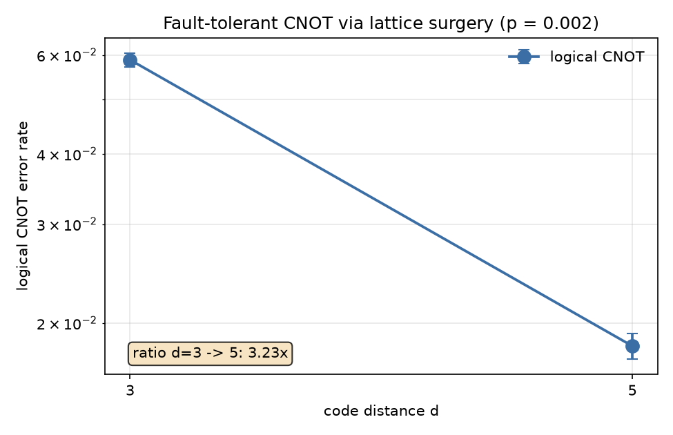

# Lattice Surgery: Fault-Tolerant Logical CNOT

## 1. Overview

`src/LatticeSurgery.py` builds and samples a logical CNOT between two distance-d rotated surface code patches. It uses no transversal gate and no physical correction gate. The CNOT is three joint Pauli measurements, each made by merging two patches into one larger patch and splitting it again. The measurement outcomes update a classical Pauli frame.

| Component | File | Role |
|---|---|---|
| Geometry, circuit builder, `LatticeSurgery` | `src/LatticeSurgery.py` | Region stabilizers, stim circuits, exact checks, noisy sampling |
| Memory experiment, noise models, decoders | `src/SurfaceCode.py` | `NOISE_MODELS`, `make_decoder`, `DEFAULT_P` (reused here) |
| Benchmark | `benchmarks/qec_lattice_surgery.py` | CNOT error vs distance, plot |

The noise model is SD6 from `SurfaceCode.py`, with one parameter p on every location. Numbers are not comparable to SI1000 devices at the same nominal p.

## 2. Physics

### Boundaries

Data qubits sit on integer (row, col). A check sits between four data qubits and is labelled by its top-left corner (i, j). It is an X check when i + j is even and a Z check otherwise. A patch keeps every weight-4 check inside it, plus:

- weight-2 **X** checks on its top and bottom edges (an **X boundary**),
- weight-2 **Z** checks on its left and right edges (a **Z boundary**).

| Logical operator | Shape | Why it ends there |
|---|---|---|
| X | a column of X, top X boundary to bottom X boundary | an X chain flips Z checks only at its ends, so it can end only where a Z check is missing, which is an X boundary |
| Z | a row of Z, left Z boundary to right Z boundary | same argument with X and Z swapped |

The task brief paired rough/smooth with check types the other way round. The pairing above is the one the stabilizer algebra forces. `_check_geometry(d)` asserts the counts (d² − 1 checks, one logical qubit), X/Z commutation, the logical operators and the seam products for every region used.

### Why a merge measures a joint operator

Stack patch B under patch A with one row of fresh qubits (the strip) between them, so an X boundary faces an X boundary. Prepare the strip in |+> and measure the checks of the combined rectangle.

- Away from the seam nothing changes.
- At the seam the weight-2 X checks become weight-4 X checks reaching into the strip. Their values are already known (old boundary check times the strip's +1 X values).
- A new row of Z checks appears across the strip. Their outcomes are random.
- Every strip qubit lies in exactly two seam Z checks, so the product of all seam Z checks is Z_A (one row of A) times Z_B (one row of B), with the strip cancelled.

The product of the random seam outcomes is therefore the value of Z_A Z_B, and it is the only logical information they carry. The merge projects onto an eigenspace of Z_A Z_B and erases one bit, the parity, not the individual values. Merging side by side along Z boundaries with the strip in |0> measures X_A X_B the same way.

**Split.** Measure the strip qubits in the basis they were prepared in. Their product with the weight-4 seam X checks restores the old weight-2 boundary checks, and the random seam Z checks are dropped. The strip's own outcome is not discarded: the merged logical operator of the other type runs through patch, strip and patch, so once the strip is read out its outcome in that column or row joins the Pauli frame. Leaving it out makes the X-sector CNOT wrong in half the shots.

### Three-measurement CNOT

Control C, target T, ancilla A prepared in |+>:

```
M_ZZ(C, A) -> m1,    M_XX(A, T) -> m2,    M_Z(A) -> m3
```

Following each logical Pauli through the three measurements:

```
X_C -> (-1)^m2 X_C X_T      Z_C -> Z_C
X_T -> X_T                  Z_T -> (-1)^(m1+m3) Z_C Z_T
```

This is CNOT followed by Z_C^m2 X_T^(m1 xor m3), so

```
|c, t>  ->  |c, c xor t>   after   X_T^(m1 xor m3),  Z_C^m2   (tracked, not applied)
```

In the implementation A is read out as part of the final data measurement, not as a separate M_Z(A) step. The truth table below is the check that this bookkeeping is right.

### Pauli frame

No correction gate is ever applied. The frame bits are folded into the logical observables, so the decoder is scored on whether it infers the frame correctly. On the surface code the strip outcomes join the frame (see Split), and the logical operators must be read on consistent rows and columns, because a different row or column differs by stabilizers that are random bits after a merge and split.

The brief's five-step AuxCNOT (grow, split, merge, conditional Z, shrink) is a more compact patch schedule. It is not implemented here. This is the textbook version, because every step can be checked against the flow table above.

## 3. Layout

d is the distance. The grid is W = 2d + 1 rows and columns.

```
          cols 0..d-1        col d       cols d+1..2d
C         rows 0..d-1
g1        row d              strip for the ZZ merge, prepared in |+>
A         rows d+1..2d   +   g2 (|0>)  +   T   rows d+1..2d
```

- C, g1, A form one rectangle of 2d + 1 rows (`CA`).
- A, g2, T form one rectangle of 2d + 1 columns (`AT`).
- Each patch origin has row + col even, which keeps the check parity of every merged rectangle identical to the parity of its parts. `Region` rejects an odd-parity origin.

Schedule, with `rounds` rounds per stage (default d):

| Stage | Regions measured | Notes |
|---|---|---|
| prepare | C, A, T | C, T in the sector basis, A in \|+> |
| merge ZZ | CA, T | g1 reset in \|+>; m1 = product of seam Z checks |
| split | C, A, T | g1 measured in X, outcomes retired for later detectors |
| merge XX | C, AT | g2 reset in \|0>; m2 = product of seam X checks |
| readout | all data | measured in the sector basis |

## 4. Syndrome Circuit

**Gate order.** X checks touch NW, NE, SW, SE. Z checks touch NW, SW, NE, SE. Two checks never touch one data qubit in the same step, and every X/Z pair that shares two data qubits meets them in the same relative order, so the checks commute under the circuit.

**Hook errors.** A mid-circuit ancilla fault spreads to the last two qubits of its check: a horizontal pair for X checks and a vertical pair for Z checks. Both are perpendicular to the logical operator they could extend (X columns, Z rows), so hook errors do not cut the distance.

**Detectors.** `_Builder._reference` returns the earlier outcomes whose parity equals each check, so every detector is deterministic:

| Situation | Reference for a check |
|---|---|
| Check measured last round | its previous outcome |
| Merge or prepare (some qubits just reset in the check's own basis) | the old check on the remaining qubits |
| Split (larger check last round) | the larger check times the strip outcomes read out in this basis |
| Reset in the opposite basis, or unknown history | none: the check is random, so no detector |

At the end, `final_detectors` compares each last-round check of the readout basis with the data outcomes. `round_log` records (stage, checks, detectors) per round, which shows where detectors are missing.

**Two sectors.** The frame bits act on different Paulis, so two sectors are decoded.

| Sector | Inputs | obs0 | obs1 |
|---|---|---|---|
| z | \|c>, \|t> | Z_C (a row of C) = c | (row through A, g2, T) xor m1 = c xor t |
| x | X eigenstates, 1 = minus | X_C (column d − 1 of C) xor m2 xor (g1 outcome in column d − 1) = c_x xor t_x | X_T (a column of T) = t_x |

Together the sectors check the CNOT on all four Z-basis and all four X-basis inputs. The reported logical error rate is the sum of the two sector failure probabilities, an upper bound on the probability that a random CNOT is wrong in either basis.

The four inputs differ only by noiseless X/Z gates on the input state, and stim reports detectors and observables as flips against the noiseless run. One detector error model and one decoder therefore serve all four inputs in a sector. The model must decompose into graphlike errors for MWPM, and `_graphlike_dem` raises otherwise.

## 5. Results

### Self-test (p = 0)

`python3 src/LatticeSurgery.py` runs `_self_test()`:

| Check | Result |
|---|---|
| `_check_geometry` for d = 3, 5, 7 | passes |
| CNOT truth table, both sectors, all four inputs (8 rows) | 0 failures |
| Frame acts and does not act in both branches | both values observed |
| Uncorrected readout wrong in some shots, frame-corrected never | holds |
| m1, m2: random, repeat every round, equal the joint operator on the final data | holds |
| Detectors and observables never fire at p = 0 (d = 3, 5) | holds |
| Detector error model decomposes into graphlike errors (d = 3, 5) | holds |
| Failure rate rises from p = 0.001 to 0.004 (d = 3) | holds |
| Invalid inputs raise `ValueError` | holds |

### CNOT error against distance

Settings: `run_scan` defaults, SD6 noise, p = 0.002, MWPM, 20,000 shots per sector, `rounds = d`.

| d | CNOT error (z + x) |
|---|---|
| 3 | 5.88e-2 ± 1.7e-3 |
| 5 | 1.82e-2 ± 9.5e-4 |

The ratio is 3.23 ± 0.19, the error bar propagated from the two standard errors. The error falls with distance, so p = 0.002 is below threshold for this circuit. This is a CNOT error per gate, not per round, and it includes both merges and the preparation stage.



How to read the ratio:

- It is one suppression step, d = 3 to 5, with two points. It is not a fitted Λ.
- The memory-experiment Λ in `docs/QEC.md` is a different quantity and should not be compared directly. The CNOT contains two merges and three patches, so it has many more fault locations per logical operation.
- The truth-table and detector checks establish that the circuit is correct. The ratio establishes that it is fault tolerant at these settings.

## 6. Connection to Pangaea

A merge is a block of space-time in which the code is larger, and a split closes it. A circuit of merges and splits is a 3D object: patches are sheets extruded in time, and a merge is a pipe joining two sheets. The brief describes Qarakal's Pangaea as the 3D generalization of that picture. **This was taken from the brief and not checked against Qarakal material.**

What carries over from this code is the mechanics:

- seam checks and strip preparation and readout,
- detectors across a change of check set,
- a frame that carries the measurement outcomes,
- a graphlike detector error model for a space-time decoder.

The implementation here is a fixed three-patch schedule, not a general layout compiler.

## 7. API

```python
from LatticeSurgery import LatticeSurgery, run_scan

ls = LatticeSurgery(distance=3, p=0.002, rounds=None, noise="sd6", decoder="mwpm")

ls.verify_truth_table()               # bool, exact at p = 0 (both sectors, all inputs)
print(ls.truth_table_report())        # per-row failures and frame statistics
ls.merge_report()                     # joint-operator checks for both merges

res = ls.sample_cnot(n_shots=20000, seed=0)   # needs p > 0
print(res)                            # CNOTResult

run_scan(distances=(3, 5), p=0.002)   # error vs distance, prints ratios
```

| Class or function | Purpose |
|---|---|
| `LatticeSurgery(distance, p, rounds, noise, decoder)` | `distance` odd and ≥ 3, `p` in [0, 1], `noise` in `NOISE_MODELS`, `decoder` is "mwpm", "correlated" or a Decoder object |
| `.experiment(c, t, sector, stop, noiseless)` | one `CNOTExperiment`; `stop="merge1"` stops after the ZZ merge (z sector only) |
| `.cnot_circuit(c, t, sector)` | the stim circuit |
| `.num_qubits`, `.num_detectors` | circuit size |
| `.circuit_distance(sector)` | smallest undetectable logical fault by graphlike search |
| `.truth_table_report`, `.verify_truth_table`, `.merge_report` | exact p = 0 checks |
| `.sample_cnot(n_shots, seed, batch)` | decode shots in both sectors, returns `CNOTResult` |
| `CNOTExperiment` | circuit, input bits, per-round seam indices (`m1_rounds`, `m2_rounds`), `readout`, `strip1`, `round_log`; `.outputs(rec)` returns (control, target, raw, frame); `.expected()` |
| `CNOTResult` | `distance`, `p`, `shots`, `truth_table_failures` (z), `x_sector_failures`, `error_rate`, `error_rate_se`, `rounds`, `seconds` |
| `Region`, `Stabilizer`, `region_stabilizers` | geometry of one code from a rectangle |
| `TruthTableRow/Report`, `MergeReport` | exact-check reports |

## 8. Limitations

- **Distances.** Noisy sampling is reported for d = 3 and 5 only. Two points do not give a threshold or a fitted Λ. `circuit_distance` is slow for d ≥ 5.
- **Circuit distance.** The graphlike search can overestimate the true circuit distance if the minimum fault is a hyperedge.
- **Decoding.** Offline batch decoding of the full space-time model. There is no real-time or streaming decoder, and no decoding latency model.
- **Noise.** SD6 only, uniform p. No leakage, crosstalk or biased noise. Strip qubits get reset and measurement errors but no special treatment.
- **Gate set.** One CNOT between fresh patches. No idle patches waiting for other operations, no non-Clifford gates, no routing.
- **Schedule.** The textbook three-measurement version, not the compact AuxCNOT schedule.
- **Rounds.** Each stage runs `rounds = d` rounds. Shorter merges were not studied.
- **Error rate.** The z + x sum is an upper bound on a random CNOT being wrong, not an average process infidelity.
- **No 3D module extension.** See section 9.

## 9. Next

3D extension for Pangaea: represent a computation as sheets and pipes in space-time and generate the seam checks, strip preparation and detectors from that description. The detector-reference logic in `_Builder._reference` (previous check, old check on fresh qubits, larger check times strip outcomes) is the part that generalizes. Before that, run d = 7 for a third point on the suppression curve.