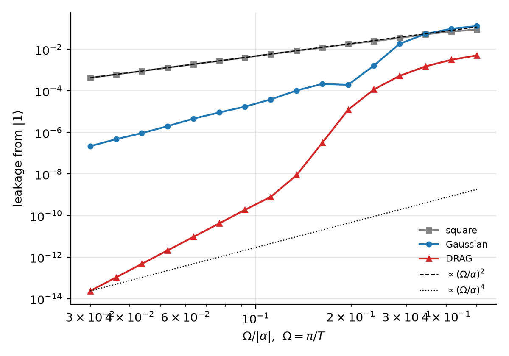
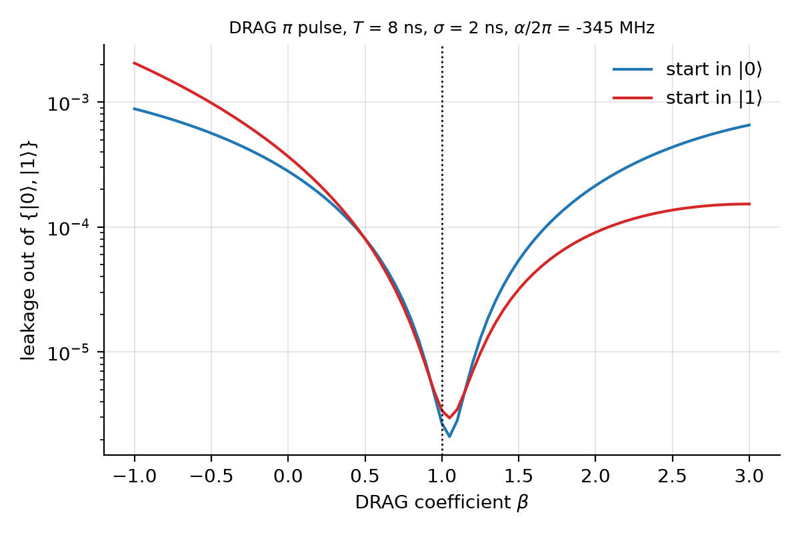
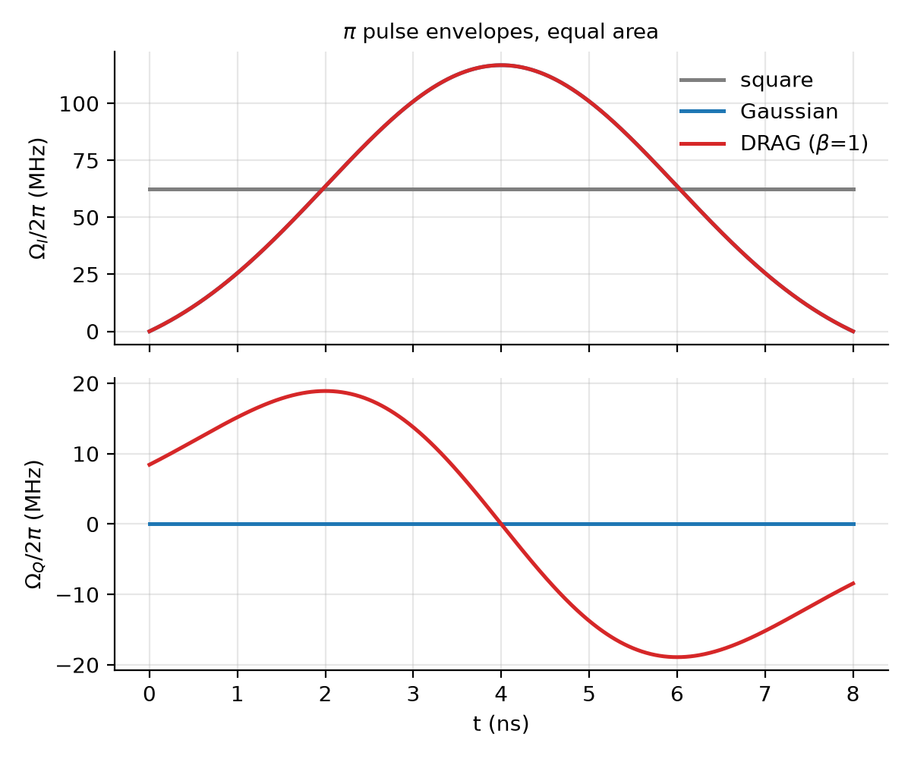
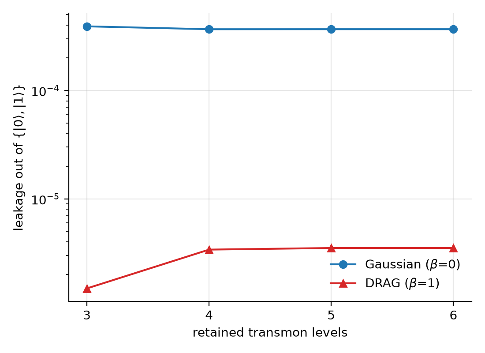
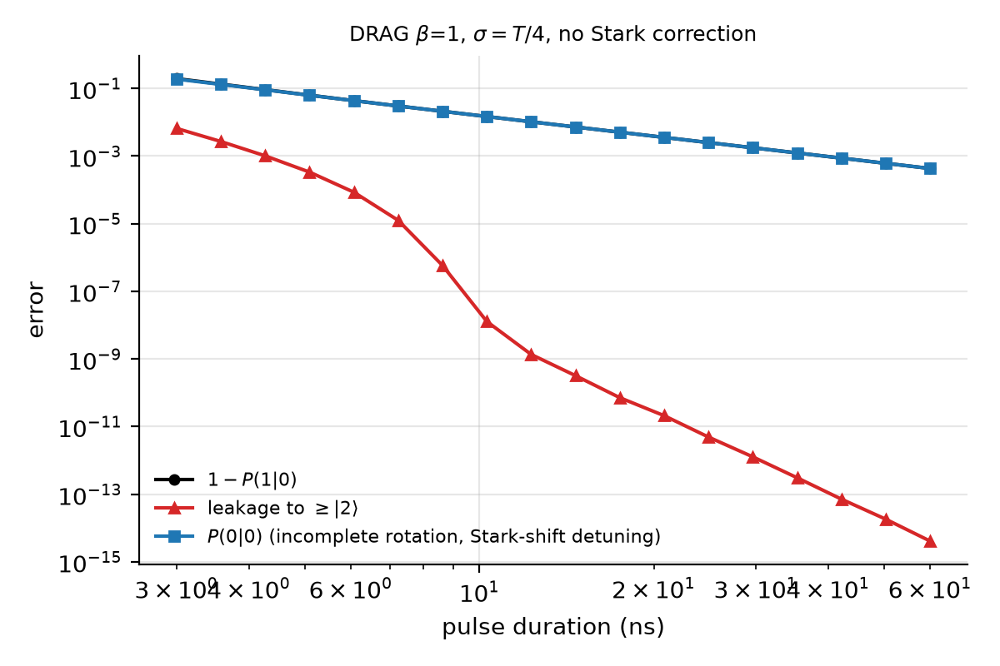

# Pulse-Level Transmon Simulation (Tier 3)

## 1. Overview

Tier 3 adds pulse-level control of a superconducting transmon to Lightning-Lite.

| Component | Files | Role |
|---|---|---|
| `Transmon` | `src/Transmon.h/.cpp` | Charge-basis diagonalization, spectrum, matrix elements, RK4 propagator, leakage |
| DRAG / pulse shapes | `src/DRAG.cpp` | Square, truncated Gaussian, first-order DRAG envelopes |
| `LindbladSolver` | `src/SchrodingerSolver.cpp` | RK4 master-equation solver on the density matrix |
| Bindings | `src/bindings_pulse.cpp` | Python module `quantum_sim_pulse` |
| Python layer | `python/pulse.py` | Pulse constructors, `beta_sweep`, `leak_vs_nlevels` |
| Benchmark | `benchmarks/drag_leakage.py` | Five plots in `docs/images/` |

**Units.** E/h quantities (EJ, EC, frequencies, $\alpha$) are in Hz. Angular quantities ($\omega$, envelopes, drive frequency) are in rad/s. Times are in seconds. $\hbar$ never appears explicitly.

## 2. Transmon Physics

### Hamiltonian

$$H = 4E_C (n - n_g)^2 - E_J \cos\varphi, \qquad [\varphi, n] = i$$

Since $e^{i\varphi}$ raises $n$ by one, $\cos\varphi = \tfrac12 \sum_n (|n\rangle\langle n+1| + \text{h.c.})$. In the charge basis $|n\rangle$, $n = -N..N$, $H$ is real symmetric tridiagonal:

$$H_{nn} = 4E_C (n - n_g)^2, \qquad H_{n,n+1} = H_{n+1,n} = -E_J/2$$

The constructor diagonalizes it with `Eigen::SelfAdjointEigenSolver` and keeps the lowest `n_levels` eigenpairs. It rejects any retained level with edge weight above `CHARGE_EDGE_TOL = 1e-12`, which means the charge cutoff is too small. The eigenvector sign gauge is fixed so that $\langle k|n|k+1\rangle > 0$.

### Transmon limit ($E_J/E_C \gg 1$)

```
plasma frequency   sqrt(8 EJ EC)
E_01             = sqrt(8 EJ EC) - EC - EC sqrt(EC/EJ) / (2 sqrt 2)
alpha            = -EC [1 + 9/(8 sqrt 2) sqrt(EC/EJ) + O(EC/EJ)]
                 ~ -EC [1 + 0.80 sqrt(EC/EJ) + ...]
|<m+1|n|m>|      = sqrt(m+1)/2 (EJ / 2EC)^(1/4)
```

The leading result $\alpha \to -E_C$ converges slowly. At $E_J/E_C = 50$, $|\alpha|$ is about 11% larger than $E_C$. Use `anharmonicity_asymptotic()` at moderate ratios.

**Reference device:** $E_C$ = 300 MHz, $E_J/E_C$ = 50, giving $f_{01} \approx$ 5.68 GHz and $\alpha/2\pi \approx$ -345 MHz.

### Drive model

The drive couples through $C = n / \langle 0|n|1\rangle$, so $C_{01} = 1$ and $C_{12} \approx \sqrt2$. In the frame rotating at $\omega_d$, with $\Delta_j = \omega_j - j\omega_d$:

```
RWA:   H_rot = sum_j Delta_j |j><j| + 1/2 sum_j c_{j,j+1} [ Omega*(t) |j><j+1| + Omega(t) |j+1><j| ]
Full:  H_rot = sum_j Delta_j |j><j| + f(t) sum_ij c_ij exp(i (i-j) w_d t) |i><j|
       f(t) = Re[ Omega(t) exp(-i w_d t) ]
```

The propagator solves $dU/dt = -iH_{rot}(t)U$ with fixed-step RK4. In `AUTO_STEPS` mode, dt is chosen so that `rate_bound * dt <= 0.01`. A user-supplied step count is rejected above 0.02.

## 3. DRAG Theory

A transmon is a weakly anharmonic oscillator, so a resonant 0-1 drive also has spectral weight at the 1-2 transition, detuned by $\alpha$. This drives $|1\rangle \to |2\rangle$ and causes leakage.

Envelopes are $\Omega(t) = \Omega_I + i\Omega_Q$, normalized so that $\int \mathrm{Re}\,\Omega\, dt = \theta$.

```
square    Omega = theta / T
Gaussian  truncated, zero-offset:  x(t) = A [ exp(-(t - T/2)^2 / (2 sigma^2)) - e0 ]
DRAG      Omega_I = x(t),   Omega_Q = -beta * x'(t) / alpha      (beta = 1 at first order)
```

The derivative quadrature cancels, to first order in $1/\alpha$, the drive's spectral component at the 1-2 transition (Motzoi et al., PRL 103, 110501). Setting $\beta = 0$ recovers the plain Gaussian.

### Leakage scaling

Pulses are $\theta = \pi$, resonant at $\omega_{01}$, with $\Omega = \pi/T$ and $\sigma = T/4$. The sweep covers $\Omega/|\alpha|$ from 0.03 to 0.5.

| Pulse | Reference exponent | Fitted slope ($\Omega/\|\alpha\| \le 0.15$) |
|---|---|---|
| square | 2 | **1.99** |
| Gaussian | 4 | **4.02** |
| DRAG ($\beta = 1$) | 8 | **8.26** |

The fitted slopes are not strict power laws for the smooth pulses. Their leakage is set by spectral tails, so the fitted slope depends on the fit window. The square-pulse exponent is the only one with a clean perturbative derivation, $P_2 \approx (c_{12}\Omega / 2\alpha)^2$.



### Beta sweep

With T = 8 ns and $\sigma$ = 2 ns, leakage from $|1\rangle$ is minimized at $\beta \approx 1.05$. Leakage at $\beta = 1$ is **108x** lower than at $\beta = 0$. The minimum sits slightly above 1 because the first-order cancellation is not exact at this gate speed.





## 4. Lindblad Dynamics

$$\frac{d\rho}{dt} = -i[H(t), \rho] + \sum_k \gamma_k \left( L_k \rho L_k^\dagger - \tfrac12 \{ L_k^\dagger L_k, \rho \} \right)$$

`LindbladSolver(dim, H(t), ops)` takes $H(t)$ in rad/s, each $L_k$ as a dim x dim matrix, and each $\gamma_k$ in 1/s. Dimension is limited to $d \le 2^{10}$ (`SOLVER_MAX_QUBITS = 10`).

**Method: RK4 on the d x d matrix, not the d^2-vector.** A vectorized Liouvillian costs $O(d^4)$ per application. The matrix form costs $O((2+K)\,d^3)$ per stage for K jump operators.

The right-hand side is evaluated as

$$\dot\rho = M + M^\dagger + \sum_k \gamma_k L_k \rho L_k^\dagger, \qquad M = (-iH - \Gamma)\rho, \qquad \Gamma = \tfrac12 \sum_k \gamma_k L_k^\dagger L_k$$

This is Hermitian by construction. Each term is traceless, so trace is preserved to round-off.

**Euler is not used.** It is first order, and its amplification factor $|1 - iz|$ exceeds 1 for every $z$.

**Step control.** The rate bound is $2\max\|H(t)\|_\infty + 2\sum_k \gamma_k \|L_k\|_1 \|L_k\|_\infty$, with $\|H\|$ sampled at 1025 points. Sampling cannot detect time dependence faster than the grid, so pass explicit `steps` for rapidly oscillating $H(t)$.

## 5. Validation

All checks run in the `#ifdef LL_TEST` block of each `.cpp`. All PASS.

### Transmon (17 checks)

| Check | Tolerance |
|---|---|
| $\alpha$ vs asymptotic: rel. error at $E_J/E_C$ = 500, and decreasing in $E_J/E_C$ | 5e-3 |
| $\|\alpha + E_C\|/E_C$ at $E_J/E_C$ = 500, and decreasing in $E_J/E_C$ | 0.06 |
| $f_{01}$ vs transmon-limit expansion ($E_J/E_C$ = 20 to 500) | 1e-2 |
| Parity: $n_{ij} = 0$ for $i + j$ even at $n_g = 0$ | 1e-10 |
| $n_{12}/n_{01} \to \sqrt2$ at $E_J/E_C$ = 100, and shrinking toward 500 | 0.15 |
| $n_{01}$ vs `n01_asymptotic()` | 5e-2 |
| Weak-drive leakage / $(\Omega/\alpha)^2$ vs $c_{12}^2/4$ | 3e-2 |
| Same ratio, spread over $\Omega/\|\alpha\|$ = 0.01 to 0.2 | 0.15 |
| n_levels saturation (3 to 6) | 2e-3 |
| RK4 vs exact $e^{-iHT}$, constant RWA pulse | 1e-7 |
| Unitarity $\|U^\dagger U - 1\|$ | 1e-8 |
| Hermiticity of $H_{rot}$ (RWA, Full) | 1e-6 |
| Input-contract exceptions | all thrown |

### DRAG (11 checks)

| Check | Tolerance |
|---|---|
| Area $\int \mathrm{Re}\,\Omega\, dt = \theta$ (square, Gaussian, DRAG; $\theta$ = $\pi/2$, $\pi$, $2\pi$) | 1e-8 |
| $\mathrm{Re}\,\Omega$ vanishes at t = 0, T | 1e-12 |
| $\mathrm{Re}\,\Omega$ even and $\mathrm{Im}\,\Omega$ odd about T/2 | 1e-12 |
| $\Omega_Q = -\beta\,\Omega_I'/\alpha$ (finite difference) | 1e-6 |
| leak($\beta$=1) / leak($\beta$=0) | < 0.5 |
| Wrong-sign DRAG worsens leakage | pass/fail |
| 1 - P(1\|0) with DRAG $\pi$ pulse | 5e-2 |
| Unitarity $\|U^\dagger U - 1\|$ | 1e-8 |
| Input-contract exceptions | all thrown |

### Lindblad (7 checks)

| Check | Tolerance |
|---|---|
| No jumps vs `Transmon::propagator` (square, sin^2 + quadrature pulse) | 1e-6 |
| No jumps vs exact $e^{-iHT}$ | 1e-7 |
| Pure dephasing: $\rho_{01} = \tfrac12 e^{-\gamma t} e^{-i\omega t}$ | 5e-8 |
| Amplitude damping: $P_1 = e^{-\gamma t}$, $\rho_{01} \propto e^{-\gamma t/2}$ | 5e-8 |
| Trace $\|\mathrm{Tr}\,\rho - 1\|$ over a driven open-system run | 1e-10 |
| Hermiticity $\|\rho - \rho^\dagger\|$ | 1e-12 |
| Positivity: min eigenvalue $\ge$ -tol | 1e-8 |
| Input-contract exceptions | all thrown |

### Benchmark results

| Result | Value |
|---|---|
| Leakage minimum ($\beta$) | 1.05 |
| Suppression at $\beta$ = 1 vs $\beta$ = 0 | 108x |
| Slopes (square / Gaussian / DRAG) | 1.99 / 4.02 / 8.26 |
| n_levels = 3 vs converged DRAG leakage | underestimates by ~2x |
| Coherent error at T = 60 ns | 4.3e-4 (leakage ~4e-15) |





## 6. API Examples

### Python

```python
import sys; sys.path[:0] = ["python", "build"]
import numpy as np
import pulse as P

tr = P.Transmon(ej=50 * 300 * P.MHZ, ec=300 * P.MHZ, n_levels=4)
print(tr.f01_ghz, tr.alpha_mhz)            # ~5.68 GHz, ~-345 MHz

wd = tr.omega_01()
gate = P.pulse_from_drag(np.pi, 8 * P.NS, 2 * P.NS, beta=1.0,
                         drive_freq=wd, transmon=tr)
print(tr.leakage(gate, initial_level=1))   # DRAG leakage from |1>
U = np.asarray(tr.propagator(gate))        # rotating-frame unitary

# beta sweep and convergence check
leak = P.beta_sweep(tr, np.pi, 8 * P.NS, 2 * P.NS, np.linspace(-1, 3, 81))
conv = P.leak_vs_nlevels(tr.ej, tr.ec, np.pi, 8 * P.NS, 2 * P.NS, 1.0, [3, 4, 5, 6])

# Open-system run
import quantum_sim_pulse as q
L = np.zeros((4, 4), complex); L[0, 1] = 1
solver = q.LindbladSolver.from_pulse(tr, gate, ops=[(L, 1e6)])
rho0 = np.zeros((4, 4), complex); rho0[0, 0] = 1
rho = solver.evolve(rho0, 0.0, gate.duration)
```

### C++

```cpp
#include "Transmon.h"
using namespace ll;

Transmon tr(15e9, 300e6, 4);
DrivePulse p{drag_envelope(M_PI, 8e-9, 2e-9, 1.0, tr.anharmonicity_angular()),
             8e-9, tr.omega_01()};
double leak = tr.leakage(p, 1);
```

`gaussian_envelope`, `drag_envelope`, and `square_envelope` are declared in `DRAG.cpp`, not yet in a header.

### Build and test

```bash
# Transmon.o: compile with -c and WITHOUT -DLL_TEST
g++ -O2 -std=c++17 -I/usr/include/eigen3 -c src/Transmon.cpp -o build/Transmon.o

g++ -O2 -std=c++17 -DLL_TEST -I/usr/include/eigen3 src/Transmon.cpp -o build/transmon_test
g++ -O2 -std=c++17 -DLL_TEST -I/usr/include/eigen3 src/DRAG.cpp build/Transmon.o -o build/drag_test
g++ -O2 -std=c++17 -DLL_TEST -I/usr/include/eigen3 src/SchrodingerSolver.cpp build/Transmon.o -o build/solver_test

python3 benchmarks/drag_leakage.py
```

The Python module is built as described at the top of `src/bindings_pulse.cpp`, with no `-DLL_TEST`.

## 7. Limitations

- **Level truncation.** Three levels are not enough for DRAG: n_levels = 3 underestimates leakage by about 2x. Use at least 4 levels. `leak_vs_nlevels` checks convergence. Fast, strong pulses need more levels.
- **RWA vs Full.** RWA drops counter-rotating terms and is accurate while the drive is far weaker than $\omega_d$. `DriveModel::Full` keeps them but needs far more RK4 steps, since $H_{rot}$ oscillates at up to n_levels $\cdot\, \omega_d$.
- **First-order DRAG only.** Higher-order corrections are not implemented. $\beta = 1$ is not exactly optimal, and the observed minimum is at 1.05.
- **No Stark-shift correction.** DRAG pulses are applied at $\omega_{01}$ without a detuning correction. At long T, coherent error dominates and leakage becomes negligible.
- **Single transmon.** No crosstalk, ZZ coupling, or multi-qubit pulses.
- **Fixed offset charge.** $n_g$ is static, so there is no charge noise. Dephasing and relaxation enter only through user-supplied Lindblad operators.
- **Fixed-step RK4.** Step selection samples $|\Omega|$ at 4096 points (propagator) and $\|H\|$ at 1025 points (solver). Envelopes with features narrower than the grid need explicit `steps`.
- **Python callables.** Envelopes built from Python callables re-acquire the GIL on every call and are slow. Use the native constructors for sweeps.

## 8. Next: Tier 4, Quantum Reservoir Computing

`Reservoir.h/.cpp` builds on this tier's `LindbladSolver` and Noise channels. It adds a driven-dissipative reservoir with readout features, benchmarked on Mackey-Glass prediction (`benchmarks/qrc_mackey_glass.py`, `docs/QRC.md`).