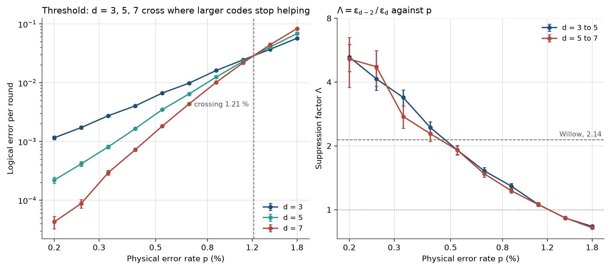
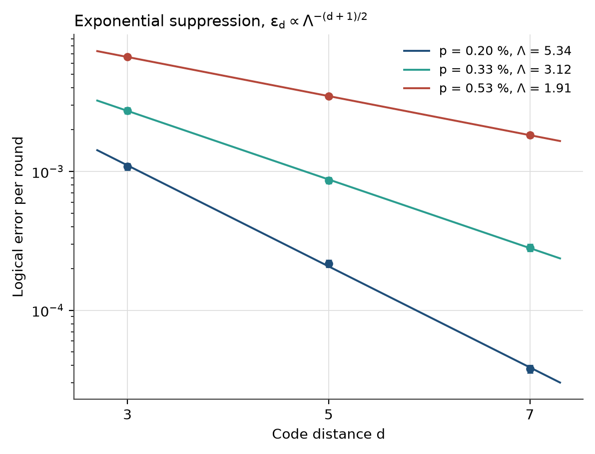

# Surface code memory and QEC in Lightning-Lite 2.0

This module simulates a rotated surface code memory experiment under circuit-level noise and decodes it with minimum-weight perfect matching (MWPM). It measures the logical error rate per round for d = 3, 5, 7, the threshold, and the error suppression factor Lambda. Code is in `src/SurfaceCode.py`, the sweep in `benchmarks/qec_threshold.py`.

## 1. Overview

A distance-d rotated surface code stores one logical qubit in d^2 data qubits, with d^2 - 1 ancilla qubits measuring the stabilizers (2 d^2 - 1 qubits in total). The memory experiment prepares the logical |0>, runs d rounds of syndrome extraction under noise, reads out every data qubit, and checks whether the decoded logical Z value survived.

The stack:

| Layer | Tool |
|---|---|
| Circuit generation | `stim.Circuit.generated("surface_code:rotated_memory_z", ...)` |
| Noise | SD6-style depolarizing noise, one parameter p |
| Error model | stim detector error model with decomposed errors |
| Decoder | PyMatching MWPM |
| Statistics | Monte Carlo sampling, binomial standard errors, per-round conversion |

Everything runs on one CPU core. The full sweep (3 distances, 10 values of p, up to 10^6 shots or 250 failures per point) takes about 10 minutes.

## 2. Physics

### 2.1 Stabilizers and logical operators

The surface code is the planar version of Kitaev's toric code. Data qubits sit on a d x d grid. Ancilla qubits measure weight-4 stabilizers (weight-2 on the boundary) of two types, X-type and Z-type, arranged in a checkerboard.

- A single X error on a data qubit flips the two neighbouring Z stabilizers. A single Z error flips two X stabilizers. Errors show up as pairs of defects, and an error chain leaves defects only at its ends.
- Logical operators are strings across the patch. Logical Z runs from one boundary to the opposite one and has weight d, and logical X runs the other way.
- A logical error needs a chain of at least (d + 1) / 2 physical errors that the decoder pairs up the wrong way, which is why the distance sets the protection.

Detectors are parities of consecutive stabilizer outcomes (round r against round r - 1). They are deterministic without noise, so a detector that fires marks a space-time defect.

### 2.2 Threshold and Lambda

Below a critical physical error rate p_th, the logical error rate falls exponentially with distance:

    eps_d ~ C / Lambda^((d + 1) / 2),    Lambda = eps_{d-2} / eps_d,    Lambda ~ p_th / p.

Above p_th, adding qubits makes the memory worse. Lambda > 1 is the operating condition for error correction.

### 2.3 Why nearest-neighbour connectivity suits superconducting qubits

Each ancilla couples only to its four data neighbours, so the whole code lives on a square lattice. That matches a 2D transmon array with fixed couplers and needs no long-range wiring. Syndrome extraction uses only CZ or CNOT, Hadamard, reset and measurement, all native on superconducting chips. Neighbouring patches can also be joined by operations on their shared boundary, which is the basis of lattice surgery.

## 3. Noise model

One parameter p drives every location (SD6, standard depolarizing noise with a six-step cycle):

| Location | stim parameter | Error |
|---|---|---|
| After every gate | `after_clifford_depolarization` | DEPOLARIZE1/2(p) |
| Data qubits, once per round (idle) | `before_round_data_depolarization` | DEPOLARIZE1(p) |
| After every reset | `after_reset_flip_probability` | X_ERROR(p) |
| Before every measurement | `before_measure_flip_probability` | X_ERROR(p) |

stim's generator places the idle error on data qubits once per round and adds no separate idle error on the ancillas, so this is slightly lighter than full SD6. That is one reason the threshold below is higher than the 0.7 % to 1 % often quoted for circuit-level noise.

All locations use the same p. Real devices have different rates for gates, readout and idling, which is why Google uses the SI1000 model (section 6).

## 4. Decoder

With independent Pauli noise, each error mechanism flips at most two detectors of one stabilizer type once Y errors are split into an X part and a Z part. Decoding then becomes: pair up the fired detectors, allowing pairs to end on a boundary, so that the total weight is minimal. Each edge has weight log((1 - q) / q) for an error of probability q, so the cheapest pairing is the most likely error pattern.

MWPM (the blossom algorithm) solves this exactly in polynomial time. It is the standard decoder for the surface code for three reasons:

- The matching structure is exact for this code under graphlike noise.
- PyMatching is fast enough for d = 7 at millions of shots on a laptop core.
- It is a common baseline, so results compare directly with the literature.

The cost of the decomposition is that X-Z correlations from Y errors are dropped. Correlated matching and tensor-network decoders recover part of that, so plain MWPM is not the best possible decoder for this noise model.

## 5. Results

SD6 noise, d = rounds, MWPM. Per-round error eps is computed from the failure probability over d rounds assuming independent flips each round:

    1 - 2 P_L = (1 - 2 eps)^rounds.

Standard errors propagate the binomial error of P_L.

| p | eps (d=3) | eps (d=5) | eps (d=7) | Lambda 3 to 5 | Lambda 5 to 7 |
|---:|---:|---:|---:|---:|---:|
| 0.20 % | 1.08e-3 | 2.17e-4 | 3.78e-5 | 4.99 +/- 0.41 | 5.75 +/- 0.50 |
| 0.33 % | 2.74e-3 | 8.63e-4 | 2.82e-4 | 3.18 +/- 0.22 | 3.06 +/- 0.23 |
| 0.42 % | 4.03e-3 | 1.65e-3 | 7.23e-4 | 2.44 +/- 0.16 | 2.28 +/- 0.18 |
| 0.53 % | 6.66e-3 | 3.48e-3 | 1.82e-3 | 1.91 +/- 0.09 | 1.91 +/- 0.10 |
| 0.87 % | 1.61e-2 | 1.25e-2 | 1.02e-2 | 1.29 +/- 0.04 | 1.23 +/- 0.03 |
| 1.41 % | 3.71e-2 | 4.06e-2 | 4.43e-2 | 0.91 +/- 0.02 | 0.92 +/- 0.01 |

The full ten-point sweep is in `benchmarks/qec_threshold.py` output.





Findings:

- **Threshold.** The d = 3 and d = 7 curves cross at p_th of about 1.21 %. The d = 5 and d = 7 curves cross in the same region (between 1.1 % and 1.4 %).
- **Suppression.** At p = 0.20 %, eps_7 = 3.78e-5 per round, a factor of 29 below d = 3, and Lambda is about 5 for both distance pairs.
- **Scaling.** The product Lambda x p stays close to 1.0 % for p between 0.2 % and 0.9 %, consistent with Lambda ~ p_th / p.
- **Lambda = 2.14** is reached at p = 0.47 % (3 to 5) and p = 0.45 % (5 to 7).
- **Breakeven.** At p = 0.20 %, d = 7 and an assumed 1.1 us cycle, the logical lifetime is 1.1 us / (2 eps) = 14.6 ms. That is 214 times a 68 us physical T1, or 122 times a 119 us best physical qubit. The simulated p is not tied to any T1, so this ratio shows the chosen p and cycle time, not a device.

## 6. Comparison with Google Willow

Google's Willow experiment (Quantum Error Correction below the Surface Code Threshold, Nature 2025) reported Lambda = 2.14 +/- 0.02 for d = 3, 5, 7 and a d = 7 logical qubit that outlives its best physical qubit by about 2.4 times. These numbers are from memory, so check them against the paper before quoting.

Our Lambda is higher at low p, and the two should not be compared as like for like:

- **Noise model.** SD6 here is uniform depolarizing noise with one p. Willow's circuits use SI1000-style, hardware-shaped rates for gates, readout, resets and idling, with measurement and reset errors well above gate errors. Willow's effective error per location is not 0.2 %.
- **Lambda depends on p.** In this model Lambda falls to 2.14 at p of about 0.46 %. Matching Willow's Lambda in this model means choosing p, not reproducing Willow's hardware.
- **Decoder.** Willow's experiment used decoders that include correlations and hardware effects. Ours is plain MWPM on a decomposed error model with a perfect knowledge of the noise.
- **Physics left out.** The simulation has no leakage, no crosstalk and no drift, all of which limit Lambda on a real chip.

What the comparison supports: the simulator reproduces below-threshold behaviour, exponential suppression with distance, and a threshold of the expected size. It does not reproduce Willow's numbers, and it does not claim to. The d = 7 breakeven ratio of 2.4 is a hardware result, and the 214 above is not comparable to it.

## 7. API

```python
import sys
sys.path[:0] = ["src"]
import SurfaceCode as sc

# One memory experiment
mem = sc.SurfaceCodeMemory(distance=5, p=0.003)          # rounds defaults to d, basis "z"
res = mem.sample(max_shots=1_000_000, max_errors=250, seed=1)
print(res)                                               # d, p, shots, errors, P_L, eps +/- se
print(mem.num_qubits, mem.num_detectors)                 # 49 and the detector count

# Distance scan at fixed p, with Lambda, fit and breakeven
out = sc.run_scan(distances=(3, 5, 7), p=0.003)
for lam in out["lambdas"]:
    print(lam)                                           # d=3 -> 5, d=5 -> 7
print(out["fit"])                                        # weighted fit over all distances
print(out["breakeven"])

# Pieces
eps = sc.per_round_error(p_logical=0.01, rounds=5)
tau = sc.logical_lifetime(eps, cycle_time=1.1e-6)        # seconds
```

| Item | Purpose |
|---|---|
| `SurfaceCodeMemory(distance, p, rounds=None, basis="z")` | Builds the circuit, detector error model and decoder. d must be odd and at least 3. |
| `.sample(max_shots, max_errors, batch, seed)` | Samples and decodes until `max_errors` failures or `max_shots` shots. Returns `LogicalErrorRate`. |
| `.circuit`, `.detector_error_model`, `.decoder` | The underlying stim circuit, DEM and PyMatching object. |
| `lambda_pairwise(small, large)` | Lambda = eps_{d-2} / eps_d with propagated error. |
| `lambda_fit(results)` | Weighted fit of ln eps against (d + 1) / 2, needs three distances. |
| `breakeven(result, cycle_time, physical_lifetime)` | Logical lifetime over physical lifetime. |
| `run_scan(...)` | Distance scan with printed summary. |

Invalid input raises `ValueError`. A point with zero logical failures reports a zero standard error, so check `errors` before using a rate, and `lambda_pairwise` refuses to divide by it.

## 8. Limitations

- **Ideal decoder inputs.** MWPM uses the exact error model from stim, so it knows the true noise. A real decoder has to estimate it.
- **No decoder latency.** Decoding is offline and instant. A real-time decoder must keep up with the cycle time, or syndrome data backs up.
- **No leakage.** Qubits stay in the computational subspace. Leakage into |2> is a leading source of correlated errors on transmons and breaks the independent-error assumption behind MWPM.
- **Uniform noise only.** There is no crosstalk, no non-uniform qubits, no drift, no correlated errors, and no link to the transmon, DRAG or Purcell modules.
- **Finite-size effects.** With d at most 7 the threshold from curve crossings sits above the asymptotic value, and a fit of Lambda over three distances is coarse.
- **Per-round rate from one round count.** Using rounds = d folds boundary rounds into eps. A fit over several round counts, as Google does, is cleaner.
- **Statistics.** Errors are binomial only, and systematic effects from the stopping rule (250 failures) are not corrected.
- **Memory only.** There are no logical gates.

## 9. Future work

1. **Lattice surgery.** Merge and split two patches along a shared boundary to measure a joint logical operator. This is the operation Qarakal's Pangaea architecture is built around, and stim can express it with generated or hand-built circuits.
2. **Correlated matching.** Keep the X-Z correlations from Y errors and compare the threshold and Lambda with plain MWPM.
3. **Hardware-shaped noise.** Replace uniform p with the per-location rates from `noise_models.py` (T1, T2, Purcell-limited relaxation), so Lambda follows from device parameters.
4. **Leakage.** Add a leakage channel from the transmon module and a leakage-reduction step.

## References

- A. Y. Kitaev, "Fault-tolerant quantum computation by anyons," Ann. Phys. 303, 2 (2003).
- A. G. Fowler, M. Mariantoni, J. M. Martinis, A. N. Cleland, "Surface codes: Towards practical large-scale quantum computation," Phys. Rev. A 86, 032324 (2012).
- C. Gidney, "Stim: a fast stabilizer circuit simulator," Quantum 5, 497 (2021).
- O. Higgott and C. Gidney, "Sparse Blossom: correcting a million errors per core second with minimum-weight matching" (2023).
- Google Quantum AI, "Quantum error correction below the surface code threshold," Nature (2025).